# НарядAI — backend

Система электронных нарядов на ремонт оборудования горно-обогатительного предприятия. Мастер выдаёт наряд, исполнитель принимает и выполняет его с телефона (в том числе без связи), **AI проверяет качество закрытия**, руководитель видит аналитику, прогноз отказов и рейтинги.

Все модели работают **локально на сервере предприятия** — данные нарядов, фото и голос не уходят в облако.

| | |
|---|---|
| Стек | Node.js 22, TypeScript, Express 5, Prisma 6, MySQL 8.4, Socket.IO 4, Zod 4 |
| AI | Ollama `gpt-oss:20b` (текст), `gemma4:e4b` (фото), Whisper large-v3 (голос) |
| Уведомления | БД + Socket.IO + Firebase Cloud Messaging |
| Отчёты | PDF (PDFKit), Excel (ExcelJS) |
| Интеграция | 1С / ERP / ТОиР: двусторонний обмен с очередью и повторами |
| Качество | **276 автотестов, все проходят; покрытие строк 98.0%**; 6 исследований на реальных моделях |

### Главное в цифрах

| Показатель | Результат |
|---|---|
| AI-проверка закрытия: верные вердикты | **97.2%** (было 77.8%); на новых, невиданных кейсах тоже 97.2% |
| AI-проверка: найдено плохих отчётов | **100%** (было 58%) |
| AI-помощник понимает вопрос | **100%** на 24 новых вопросах, включая казахский (было 83%) |
| Ложные сигналы аналитики | **0 из 1** (было 48 из 51) |
| Вход в систему | **75 запросов/с** (было 8); подбор ПИН — ~500 ч вместо 18 мин |
| Ошибок под нагрузкой | **0** на всех эндпоинтах при 1, 10 и 50 соединениях |
| Распознавание речи (Whisper) | 16.4% ошибок в словах, 4.4% в символах; ~0.6 с на фразу |

Подробности:
- [docs/FRONTEND.md](docs/FRONTEND.md) — **документация для фронтенда**: вход, все запросы и ответы, офлайн-очередь, фото, голос, Socket.IO, push; типы — в [docs/frontend-types.ts](docs/frontend-types.ts);
- [docs/FEATURES.md](docs/FEATURES.md) — полный справочник правил и API;
- [docs/TESTING_AND_RESEARCH.md](docs/TESTING_AND_RESEARCH.md) — методики, сырые цифры, ограничения.

---

## Содержание

1. [Архитектура](#1-архитектура)
2. [Роли и права](#2-роли-и-права)
3. [Жизненный цикл наряда](#3-жизненный-цикл-наряда)
4. [Функции](#4-функции)
5. [AI-модули](#5-ai-модули)
6. [Аналитика и отчёты](#6-аналитика-и-отчёты)
7. [Безопасность](#7-безопасность)
8. [Тестирование](#8-тестирование)
9. [Исследования](#9-исследования)
10. [Найденные и исправленные дефекты](#10-найденные-и-исправленные-дефекты)
11. [Установка и запуск](#11-установка-и-запуск)
12. [Конфигурация](#12-конфигурация)
13. [API](#13-api)

---

## 1. Архитектура

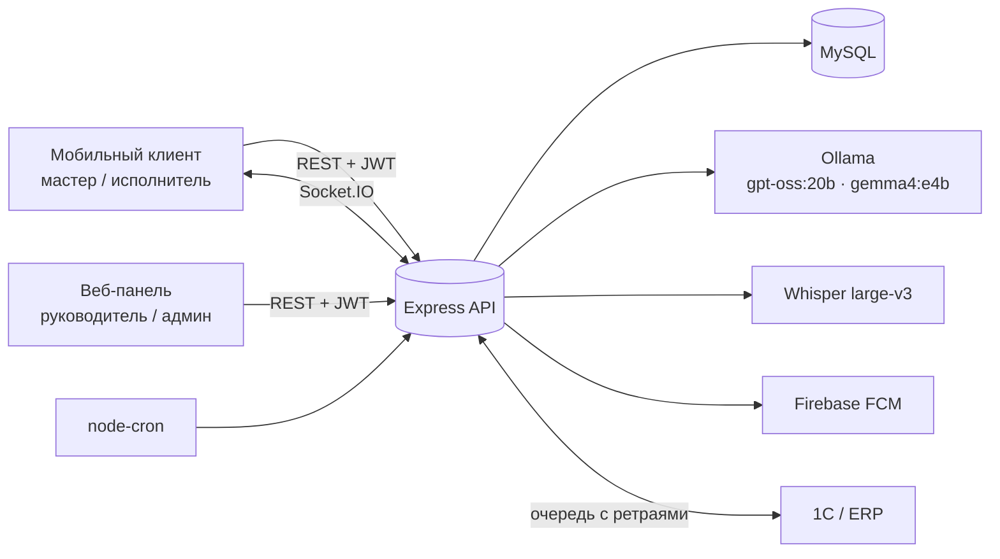

Фоновые задачи: контроль сроков и синхронизация с 1С — каждую минуту, AI-сводка недели — по понедельникам в 08:00.

```
src/
├─ app.ts, server.ts, realtime.ts, config.ts
├─ domain/work-order-state.ts     машина состояний наряда
├─ lib/                           ошибки, хеш ПИН, защита входа, подписанные ссылки
├─ middleware/                    JWT, роли, ключ 1С
├─ routes/                        13 групп эндпоинтов
└─ services/                      AI-проверка, фото, аналитика, помощник, сроки, 1С, push, Whisper
test/        unit + integration (Vitest, реальная MySQL, моки AI как HTTP-серверы)
research/    скрипты исследований и сырые результаты
docs/        полное описание, отчёт об исследованиях, графики
```

---

## 2. Роли и права

Вход — по логину и ПИН-коду, ответ — JWT на 12 часов (одна смена).

| Возможность | Мастер | Исполнитель | Руководитель | Админ |
|---|:-:|:-:|:-:|:-:|
| Создать / изменить / переназначить наряд | ✅ | — | — | ✅ |
| Видеть наряды | все | **только свои** | все | все |
| Принять / в очередь / отклонить / начать / пауза / завершить | ✅ | свои | ✅ | ✅ |
| Закрыть / вернуть на доработку / отменить | ✅ | — | — | ✅ |
| Аналитика, отчёты, рейтинги | ✅ | — | ✅ | ✅ |
| Справочники: чтение / запись | ✅ / — | ✅ / — | ✅ / — | ✅ / ✅ |
| Мониторинг интеграции с 1С | — | — | ✅ | ✅ |

У пользователя есть язык интерфейса: `ru` или `kk`.

---

## 3. Жизненный цикл наряда

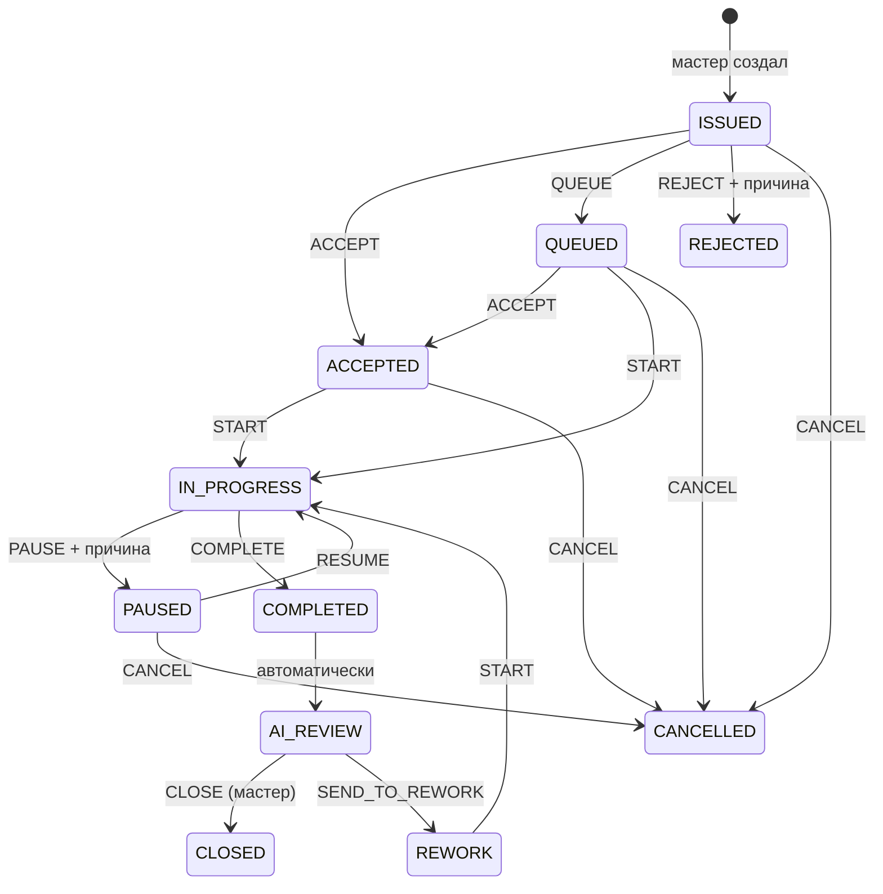

- Все действия выполняются одним запросом `POST /api/work-orders/:id/action { action }`. Разрешено 16 переходов из 110 возможных пар «действие × статус», остальные получают **409**.
- Отказ и пауза требуют причину.
- При завершении исполнитель передаёт текст отчёта, шифр неисправности, до 5 фото «после» и расход материалов. Сразу запускается **AI-проверка**, наряд переходит в `AI_REVIEW`.
- Мастер закрывает наряд с оценкой 1–5 или возвращает его на доработку. Окончательное решение всегда за ним.
- Каждое действие пишется в неизменяемый журнал, рассылается по Socket.IO, пересчитывает статус исполнителя и ставит задание в очередь 1С.

---

## 4. Функции

**Создание наряда.**
- Тип: плановый или аварийный. Приоритет: `EMERGENCY` > `HIGH` > `NORMAL` > `PLANNED`.
- Оборудование обязано принадлежать участку, назначить можно только исполнителя.
- Срок задаётся явно или считается по нормативу (часы).
- Аварийный наряд **сразу открывает простой оборудования**, а исполнителю приходит push в отдельный звуковой канал.

**Переназначение.** Только на исполнителя; завершённые, закрытые и отменённые наряды переназначить нельзя. Прежний исполнитель получает событие, чтобы наряд исчез из его очереди.

**Статусы сотрудников** пересчитываются автоматически: `AVAILABLE`, `BUSY` (есть работа), `QUEUED` (есть ожидающие), `OFF_SHIFT`.

**Офлайн-режим.** Действие с телефона несёт уникальный `clientActionId`; повторная отправка ничего не меняет и возвращает `replayed: true`. 20 одновременных повторов дают 20 ответов 200 и ровно одно событие.

**Очередь на телефоне.** Список поддерживает `limit`, `offset`, `X-Total-Count`; облегчённый вид `compact=1` без фото и материалов работает в 4 раза быстрее полного.

**Фото.**
- Автоповорот по EXIF, ужатие до 1600 px, JPEG.
- Доступ только по подписанной ссылке, которую API выдаёт сам, или с токеном.
- Антиподлог — см. [§5](#5-ai-модули).

**Материалы и нормативы.** Норматив задаёт часы и нормы расхода материалов. Перерасход больше 150% нормы отмечается в AI-проверке, системный перерасход находит аналитика.

**Контроль сроков** (проверка каждую минуту):

| Событие | Кому |
|---|---|
| До срока ≤ 30 мин | исполнителю, один раз |
| Срок прошёл | исполнителю и мастеру, повтор каждые 30 мин |
| Просрочка ≥ 120 мин | всем руководителям на смене |
| Аварийный наряд не принят за 3 мин, обычный — за 10 | мастеру: «назначьте другого» |

**Уведомления** приходят по трём каналам: лента в БД, Socket.IO (только адресату) и FCM push на все устройства пользователя. Событие об изменении наряда получают руководство и исполнитель этого наряда.

**Голосовой ввод.** `POST /api/ai/transcribe`: Whisper large-v3 на GPU, около 0.6 с на фразу. Подходит для надиктовки проблемы и отчёта.

**Оборудование и QR.** QR-код 512 px для наклейки; сканирование открывает карточку единицы; история всех ремонтов с шифрами, оценками, простоями и материалами.

**Интеграция с 1С.**
- Входящий импорт 8 типов справочников и нарядов по внешним ID, идемпотентный по `requestId`. Ошибка в элементе → 422 с ID этого элемента.
- Исходящая очередь: каждое изменение наряда отправляется в 1С с ключом идемпотентности; при ошибке — повторы через 2, 4, 8, 16, 32, 60 мин, затем статус `DEAD`.

**Работа без AI.** Если Ollama недоступна, ни одна функция не ломается: проверка, помощник, рекомендации и сводки переходят на детерминированные правила.

---

## 5. AI-модули

### AI-проверка закрытия наряда

Конвейер «**жёсткие правила → LLM → жёсткие правила**», поэтому модель не может ослабить обязательные требования.

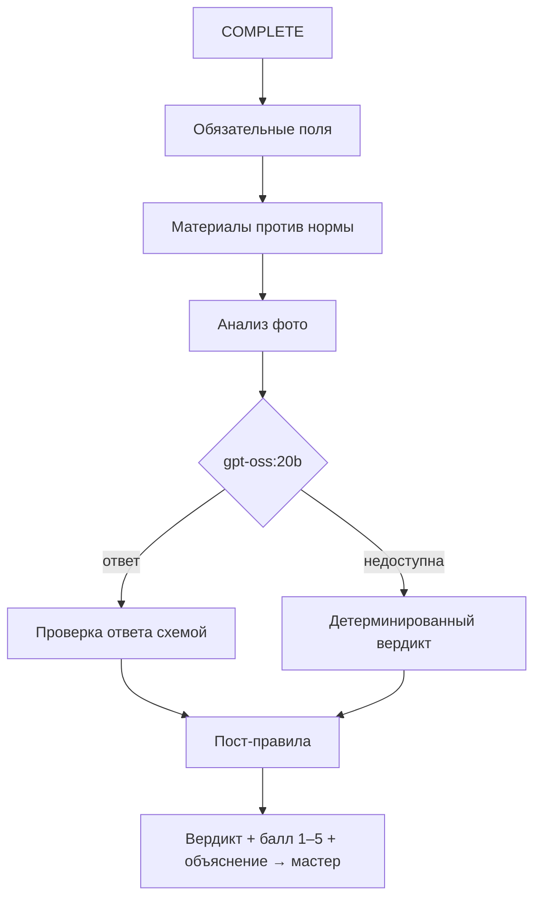

**Пост-правила:**
1. Нет описания работ, шифра или фото «после» у аварийного наряда → доработка.
2. **Нарушение безопасности** в тексте («отключил / замкнул / обошёл … защиту / концевик», «без заземления / допуска») → доработка, балл 1. Правило не зависит от модели.
3. Перерасход материала больше 150% нормы → «принято с замечаниями».
4. Фото-дубликат → доработка.

Промпт перечисляет явные критерии доработки («сделано», «всё ок», работа не выполнена, проблема осталась, нарушение технологии) и требует отвечать по-русски. Ответ модели проверяется схемой, лишние поля и неверные типы отбрасываются.

### Антиподлог фото

Для каждого фото считаются SHA-256 и перцептивный хеш (16×16, 256 бит).

| Ситуация | Итог |
|---|---|
| Фото уже было в другом наряде (точная копия) | доработка |
| Фото до и после совпадают, сходство ≥ 0.98 | доработка |
| Сходство 0.88–0.98 или похоже на фото из прошлого наряда этого оборудования | **на проверку мастеру** |
| Vision-модель: «другое оборудование» | балл 1 |
| Vision-модель: замечания безопасности | балл ≤ 2 |

### AI-помощник мастера

Вопрос текстом или голосом → LLM **только классифицирует** его в одно из 6 намерений → данные достаёт заранее написанный запрос → LLM отвечает **только по этим данным**. Произвольного SQL нет.

| Намерение | Пример |
|---|---|
| Свободные исполнители | «Кто свободен из электриков?», «Бос электриктер бар ма?» |
| Просроченные наряды | «Что горит по времени?» |
| История оборудования | «Что чинили на насосе Н-1?» |
| Итоги смены | «Как прошла смена?» |
| Аномалии | «Где повторяются одни и те же поломки?» |
| Прогноз отказов | «Какое оборудование в зоне риска?» |

### Рекомендации

- **Исполнитель:** `доступность (50 / 20 / 0) + 8 × рейтинг на этом типе оборудования − 3 × очередь`.
- **Шифр и норматив по описанию проблемы:** LLM выбирает только из справочника.

---

## 6. Аналитика и отчёты

**Аномалии:**

| Тип | Условие |
|---|---|
| Частые отказы | закрытых нарядов ≥ max(3, 1.8 × среднее по парку) |
| Повторяющийся шифр | ≥ 3 раз **и** ≥ 40% ремонтов единицы |
| Отказы после ППР | ≥ 2 аварий за 7 дней после ППР **и** доля ≥ max(0.3, 2 × по остальному парку) |
| Расход материалов | максимум > 2 × среднего |

**Прогноз отказов:**
```
рост = min(1, (недавние+1)/(предыдущие+1) − 1)
вероятность = clamp(0.15 + 0.08·недавние + 0.25·рост + 0.04·критичность, 0.05, 0.95)
```

**Дашборд:** активные и просроченные наряды, оборудование в простое, время реакции и выполнения, топ оборудования по авариям, топ исполнителей.

**Рейтинг исполнителя (0–100), формула прозрачна и возвращается в ответе:**
```
45·качество/5 + 25·доля_в_срок + 15·(1 − доля_доработок) + 10·min(1, закрыто/20)
+ min(5, сложные наряды) − 2·необоснованные отказы
```
Рейтинг бригады: 70% качество + 30% сроки. Отчёты: смена (с AI-сводкой), материалы, простои, карточка наряда, **PDF и Excel**, фильтры по периоду, участку, оборудованию, исполнителю и бригаде.

---

## 7. Безопасность

| Мера | Как |
|---|---|
| Хранение ПИН | scrypt в пуле потоков; старые bcrypt-хеши заменяются при входе |
| Защита от перебора | 5 неверных ПИН на логин или 30 на IP → блокировка 15 мин, ответ 429 + `Retry-After` |
| Доступ к данным | роли на каждом эндпоинте; исполнитель видит только свои наряды — и в REST, и в Socket.IO |
| Фото | подписанные ссылки (HMAC, 7 дней) или Bearer; без подписи — 401 |
| AI | модель не пишет SQL и не может обойти обязательные правила; ответы проверяются схемой |
| 1С | отдельный ключ, сравнение за постоянное время |
| Демо-доступ на сервере | случайные 6-значные ПИН в `demo-credentials.local.txt` (права 600, не в git) |

---

## 8. Тестирование

**276 тестов, все проходят.** Используются Vitest и supertest на **реальной MySQL** (отдельная БД `naryad_test`). Ollama, Whisper и 1С заменены настоящими HTTP-серверами, поэтому проверяются реальные запросы и ответы. Каждый найденный дефект сначала был зафиксирован падающим тестом, затем исправлен.

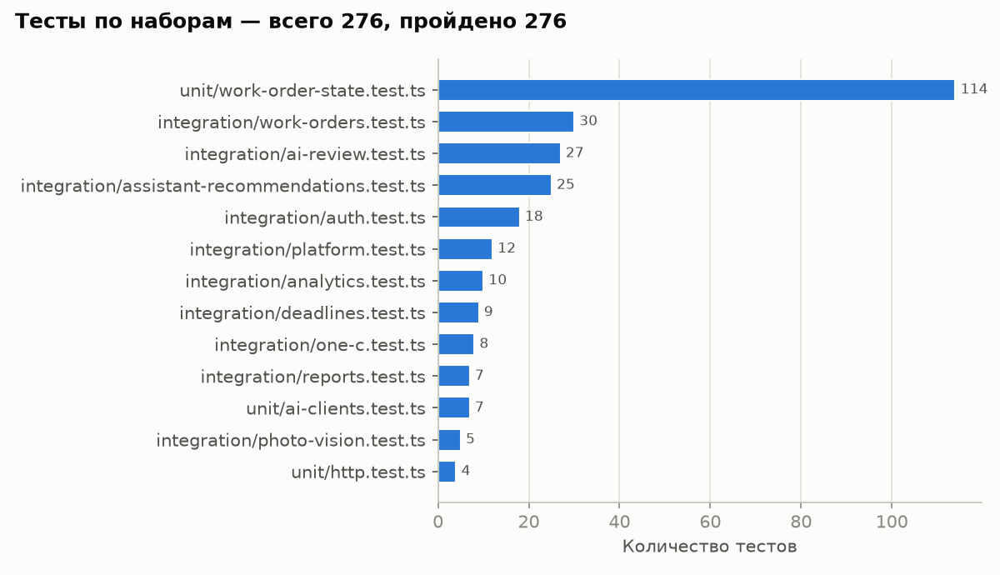

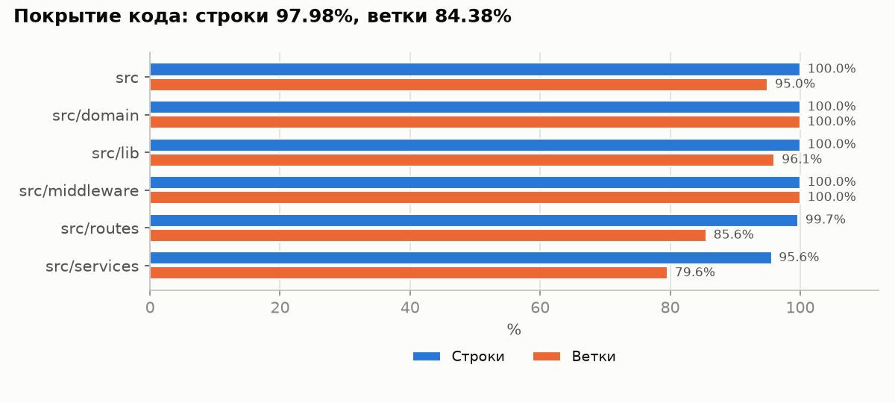

| Что покрыто | Примеры проверок |
|---|---|
| Машина состояний | все 110 пар «действие × статус» |
| Права | матрица доступа ролей, чужие наряды в REST и Socket.IO |
| Жизненный цикл | полный путь с журналом, доработка, очередь, отказы, офлайн-повторы, пагинация |
| AI-проверка | промпт, пост-правила, нарушения безопасности, мусор в ответе модели, все ветки фото |
| Сроки | напоминания, просрочки по 30 мин, эскалация, «не принят» |
| Аналитика | 4 детектора и отсутствие шума, прогноз со сверкой формулы, дашборд |
| Отчёты | ручная сверка формулы рейтинга, содержимое Excel, валидный PDF |
| 1С | импорт 8 сущностей, идемпотентность, повторы 2 → 4 → 8 мин, DEAD |
| Безопасность | блокировка перебора, bcrypt → scrypt, подписанные ссылки |

```bash
npm test
npm run test:coverage
```

---

## 9. Исследования

Шесть исследований на **реальных моделях сервера** (RTX 3090 / 3060). Для AI-модулей добавлены **отложенные наборы**, которых модель не видела при настройке, чтобы цифры не были подогнаны.

### 9.1 AI-проверка закрытия

24 размеченных отчёта (12 хороших, 12 плохих, 10 типов) × 3 прогона, плюс 12 новых отчётов × 3. Прогон идёт через **реальный** код проверки.

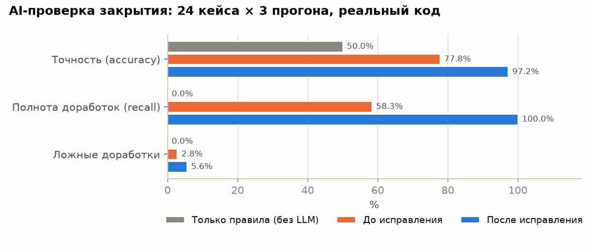

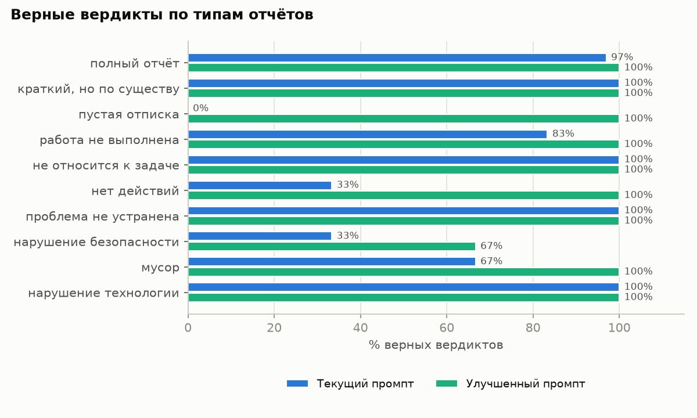

| | Только правила | До | **После** | После, новые кейсы |
|---|---|---|---|---|
| Верные вердикты | 50% | 77.8% | **97.2%** | **97.2%** |
| Найдено плохих отчётов | 0% | 58.3% | **100%** | 94.4% |
| Хорошие, ошибочно отправленные на доработку | 0% | 2.8% | 5.6% | 0% |
| Объяснения на английском | — | 36% | **0%** | 0% |

Прежний промпт принимал отписки («Сделано» — в 100% случаев) и «отключил защиту». Исправлено промптом с критериями и жёстким правилом безопасности. Цена: проверка стала строже, и 2 из 36 хороших отчётов ушли на доработку.

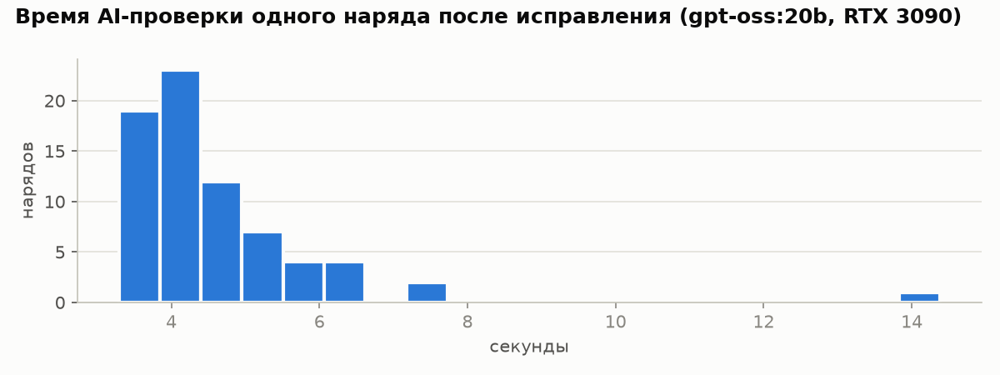

### 9.2 AI-помощник

36 вопросов + 24 новых (по 6 на казахском).

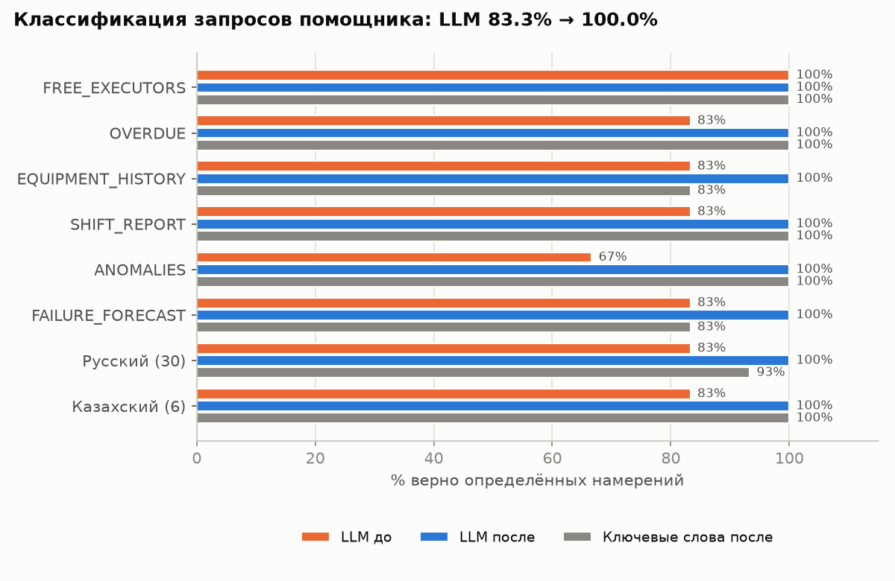

| | LLM до | LLM после | LLM, новые вопросы | Без LLM, новые вопросы |
|---|---|---|---|---|
| Верно | 83.3% | 100% | **100% (24/24)** | 37.5% |

Режим без LLM — только аварийный: словарь ключевых слов на незнакомых формулировках угадывает 37.5%.

### 9.3 Распознавание речи

20 фраз из практики ремонта, 4 голоса, шум с SNR 20, 10 и 5 дБ — 320 записей.

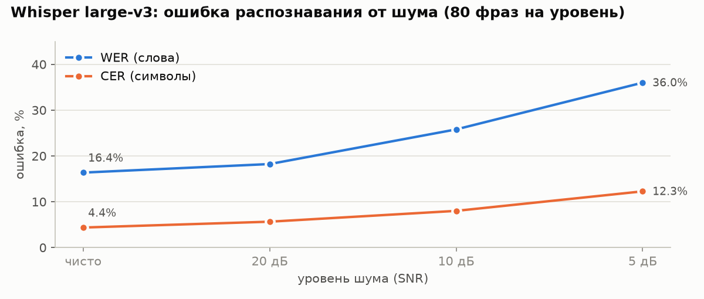

| Условия | Ошибка в словах (WER) | Ошибка в символах (CER) |
|---|---|---|
| тишина | 16.4% | 4.4% |
| тихий цех (20 дБ) | 18.2% | 5.6% |
| работающее оборудование (10 дБ) | 25.8% | 8.0% |
| громкий цех (5 дБ) | 36.0% | 12.3% |

Ошибки — в отраслевых терминах («футеровка» → «лутеровка»). Речь синтезированная, поэтому это нижняя граница ошибки.

### 9.4 Антиподлог фото

720 пар «то же фото после изменения» и 240 пар разных фото.

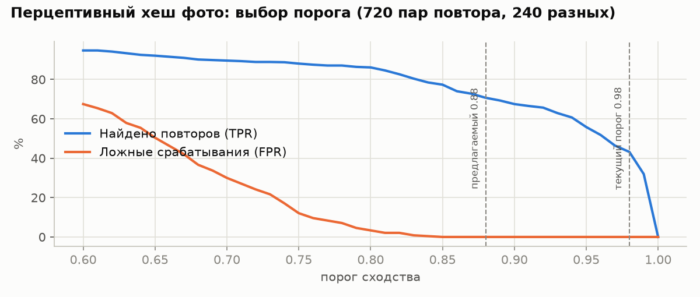

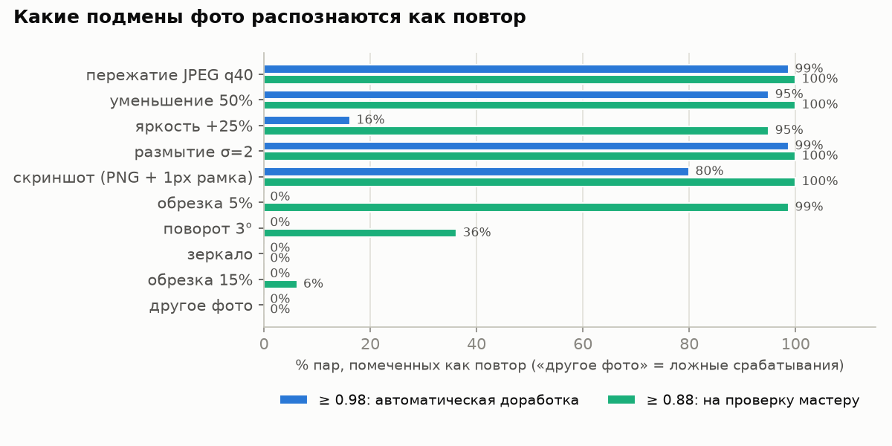

Порог 0.98 ловил 43% подмен: обрезка на 5% или +25% яркости обходили проверку. Добавленный уровень 0.88 «на проверку мастеру» ловит **71%** при **0** ложных срабатываний.

### 9.5 Нагрузка

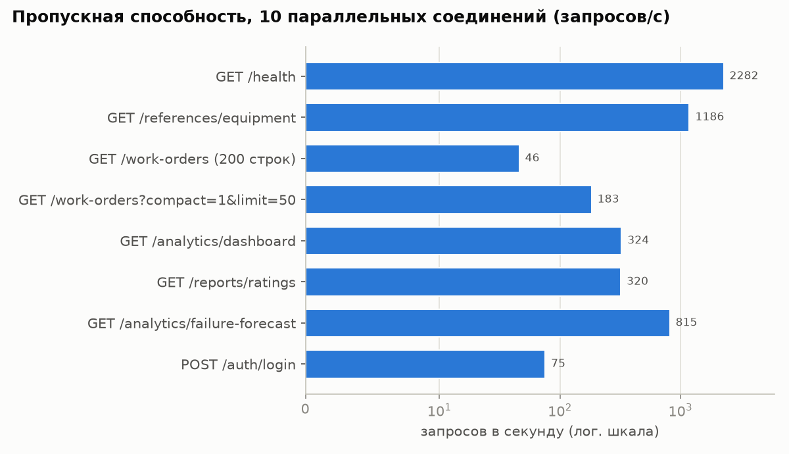

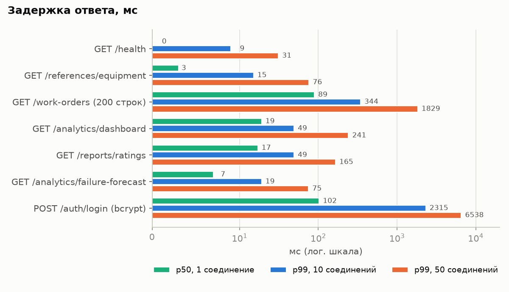

| Эндпоинт | Запросов/с (10 соединений) | p99 |
|---|---|---|
| справочник оборудования | 1186 | 16 мс |
| прогноз отказов | 815 | 19 мс |
| дашборд | 324 | 48 мс |
| очередь `compact=1&limit=50` | **183** | 89 мс |
| полный список (200 нарядов) | 46 | 342 мс |
| вход | **75** (было 8) | 160 мс (было 2315) |

Ошибок: **0**.

### 9.6 Аналитика на демо-данных

500 нарядов за 90 дней с заложенной аномалией («Конвейер К-3») и слабым исполнителем.

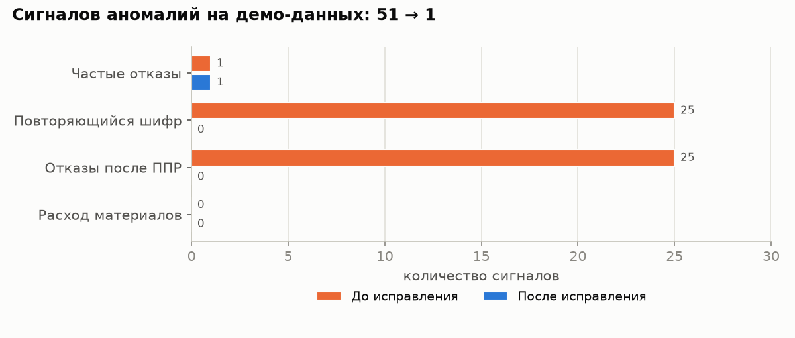

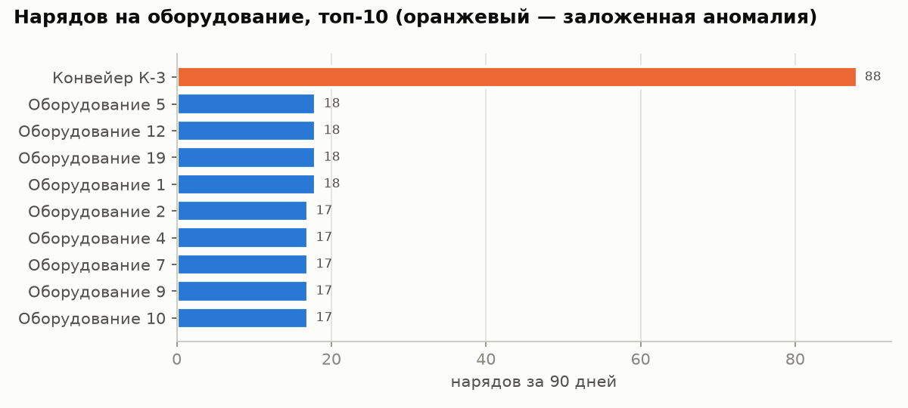

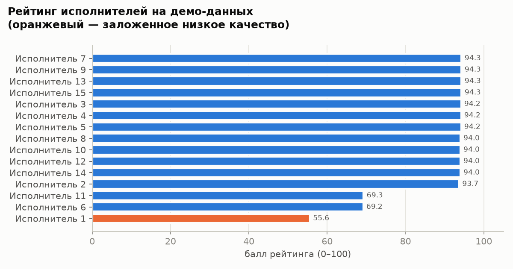

- Аномалий было 51, из них 48 — шум; стало **1**, и это реальная аномалия К-3.
- В прогнозе отказов К-3 вышел на первое место.
- Слабый исполнитель — на последнем месте рейтинга: 55.6 при медиане 94.

---

## 10. Найденные и исправленные дефекты

| Серьёзность | Было | Стало |
|---|---|---|
| 🔴 | ПИН из 4 цифр подбирался за ~18 минут | блокировка после 5 попыток, ~500 ч |
| 🔴 | плановый наряд без фото всегда уходил на доработку | фото обязательно только для аварийных |
| 🔴 | лишнее поле в ответе модели ломало закрытие наряда (500) | ответ проверяется схемой |
| 🔴 | AI-помощник периодически падал (500): модель отвечала массивом вместо текста | ответы помощника, рекомендаций и сводок проверяются |
| 🔴 | AI пропускал 42% плохих отчётов | 0% пропусков |
| 🟠 | исполнитель получал по Socket.IO чужие наряды | только свои |
| 🟠 | демо-аккаунты на сервере с ПИН `1234` | случайные ПИН |
| 🟠 | переназначение закрытого наряда и на не-исполнителя | 409 и 400 |
| 🟠 | закрытие с оценкой без AI-оценки → 500 | сохраняется оценка мастера |
| 🟠 | фото-проверка ловила 43% подмен | 71% + поиск по прошлым нарядам |
| 🟡 | фото доступны по ссылке без входа | подписанные ссылки |
| 🟡 | 94% сигналов аналитики — шум | 0% |
| 🟡 | вход 8 запросов/с, очередь 46 | 75 и 183 |
| 🟡 | 500 вместо 404, 409, 400, 422 в ряде мест | корректные коды |
| 🟡 | гонка офлайн-повторов → 500 | 200 `replayed` |

Ещё одна поправка — в миграциях БД: без неё демо-данные не загружались.

---

## 11. Установка и запуск

### На сервере (текущее развёртывание)

`docker-compose.server.yml` поднимает MySQL (`127.0.0.1:3407`) и API (`:8765`). Ollama (`:11434`) и `whisper-service` (`:8090`) используются те, что уже работают на сервере. Секреты лежат в `.env`.

```bash
docker compose -f docker-compose.server.yml up -d --build        # сборка + миграции
docker compose -f docker-compose.server.yml logs -f api
curl http://127.0.0.1:8765/health/ready                           # {"database":true,"ollama":true}
```

### Локально (всё в Docker)

```bash
cp .env.example .env
docker compose up -d --build
docker compose exec api npm run db:seed
```

Compose запускает MySQL, API и Ollama и загружает `gpt-oss:20b`. Whisper подключается через `WHISPER_URL`: поддерживается и локальный протокол `/transcribe`, и OpenAI-совместимый `/v1/audio/transcriptions`.

### Без Docker

```bash
npm install
npx prisma generate
npx prisma migrate deploy
npm run db:seed          # ⚠ стирает данные; ПИН демо-пользователей = SEED_PIN (по умолчанию 1234)
npm run dev
```

Демо-пользователи: `admin`, `master`, `manager`, `worker1` … `worker15`.

### Тесты и исследования

```bash
npm test                    # нужна БД naryad_test
npm run test:coverage
npm run research:charts     # пересобрать графики из research/results
```

Создание тестовых БД и запуск каждого исследования описаны в [docs/TESTING_AND_RESEARCH.md](docs/TESTING_AND_RESEARCH.md#9-как-воспроизвести).

---

## 12. Конфигурация

| Переменная | По умолчанию | Назначение |
|---|---|---|
| `PORT` | 8765 | порт API |
| `DATABASE_URL`, `JWT_SECRET` | — | БД и секрет JWT |
| `OLLAMA_URL`, `OLLAMA_MODEL` | `localhost:11434`, `gpt-oss:20b` | текстовая модель |
| `OLLAMA_VISION_MODEL` | пусто | модель для фото (на сервере `gemma4:e4b`) |
| `WHISPER_URL`, `WHISPER_PROMPT` | —, глоссарий | распознавание речи и словарь терминов (передаётся сервисам, которые его поддерживают) |
| `AI_STRICT` | `false` | `true` — сбой модели делает действие неуспешным |
| `DEADLINE_REMINDER_MINUTES`, `OVERDUE_REPEAT_MINUTES`, `LONG_OVERDUE_MINUTES` | 30, 30, 120 | контроль сроков |
| `LOGIN_MAX_ATTEMPTS`, `LOGIN_MAX_ATTEMPTS_PER_IP`, `LOGIN_LOCK_MINUTES` | 5, 30, 15 | защита входа |
| `UPLOAD_URL_TTL_HOURS` | 168 | срок подписанных ссылок на фото |
| `FIREBASE_SERVICE_ACCOUNT_JSON` | пусто | push-уведомления |
| `PUBLIC_APP_URL` | `localhost:8765` | база ссылок в QR |
| `ONE_C_ENABLED`, `ONE_C_BASE_URL`, `ONE_C_API_KEY`, … | выключено | интеграция с 1С |

---

## 13. API

| Группа | Эндпоинты |
|---|---|
| Служебные | `GET /health`, `GET /health/ready` |
| Вход | `POST /api/auth/login`, `GET /api/auth/me` |
| Наряды | `GET /api/work-orders?status,areaId,assigneeId,limit,offset,compact`, `POST /api/work-orders`, `GET`/`PATCH /api/work-orders/:id`, `POST /api/work-orders/:id/action`, `POST /api/work-orders/:id/reassign` |
| Файлы и голос | `POST /api/uploads`, `POST /api/ai/transcribe` |
| Справочники | `GET /api/references/areas \| equipment \| fault-codes \| materials \| brigades \| normatives \| executors` |
| Оборудование | `GET /api/equipment/:id/qr.png`, `GET /api/equipment/qr/:token`, `GET /api/equipment/:id/history` |
| AI | `GET /api/recommendations/executors?equipmentId`, `POST /api/recommendations/work`, `POST /api/assistant/chat`, `GET /api/assistant/history` |
| Уведомления | `GET /api/notifications`, `PATCH /api/notifications/:id/read`, `POST`/`DELETE /api/devices` |
| Аналитика | `GET /api/analytics/dashboard \| anomalies \| failure-forecast`, `POST /api/analytics/anomalies/run` |
| Отчёты | `GET /api/reports/shift \| ratings \| brigade-ratings \| materials \| downtime \| work-order/:id \| export.xlsx \| export.pdf` |
| Админ | `GET /api/admin/users`, `POST`/`PATCH`/`DELETE /api/admin/{areas,equipment,fault-codes,materials,brigades,normatives,users}`, `PATCH /api/admin/users/:id/shift` |
| 1С | `POST /api/integrations/1c/import`, `GET /1c/ping` (ключ 1С); `GET /api/integrations/orders \| 1c/jobs \| 1c/mappings`, `POST /1c/run \| 1c/jobs/:id/retry \| 1c/push/orders` |

Отчёты принимают `from`, `to`, `areaId`, `equipmentId`, `executorId`, `brigadeId`.

Socket.IO:
```ts
io("http://localhost:8765", { auth: { token } });   // события: work-order:changed, notification:new
```

Коды ошибок: `400` данные · `401` вход или подпись · `403` права · `404` не найдено · `409` конфликт статуса или ссылок · `422` речь не распознана или ошибка импорта · `429` блокировка входа · `502` Whisper недоступен.
