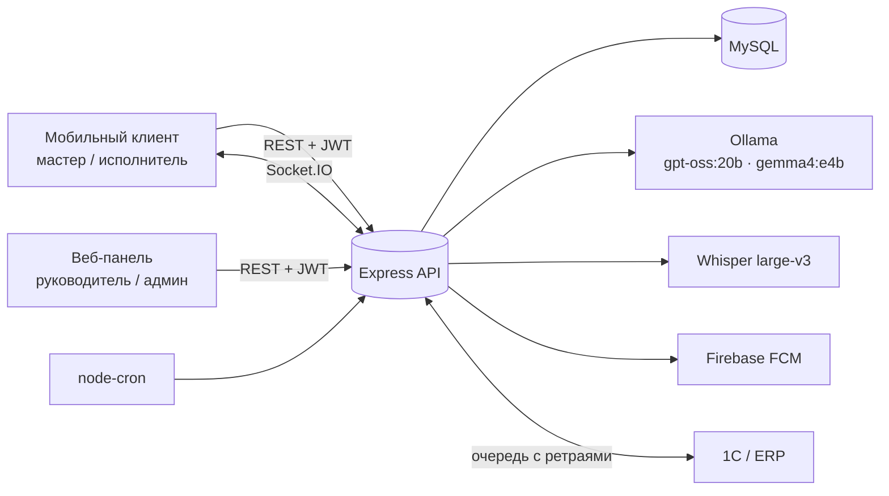
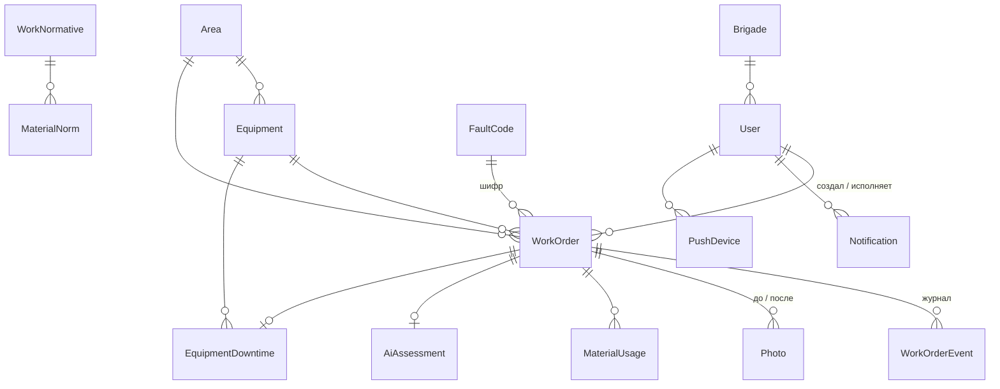
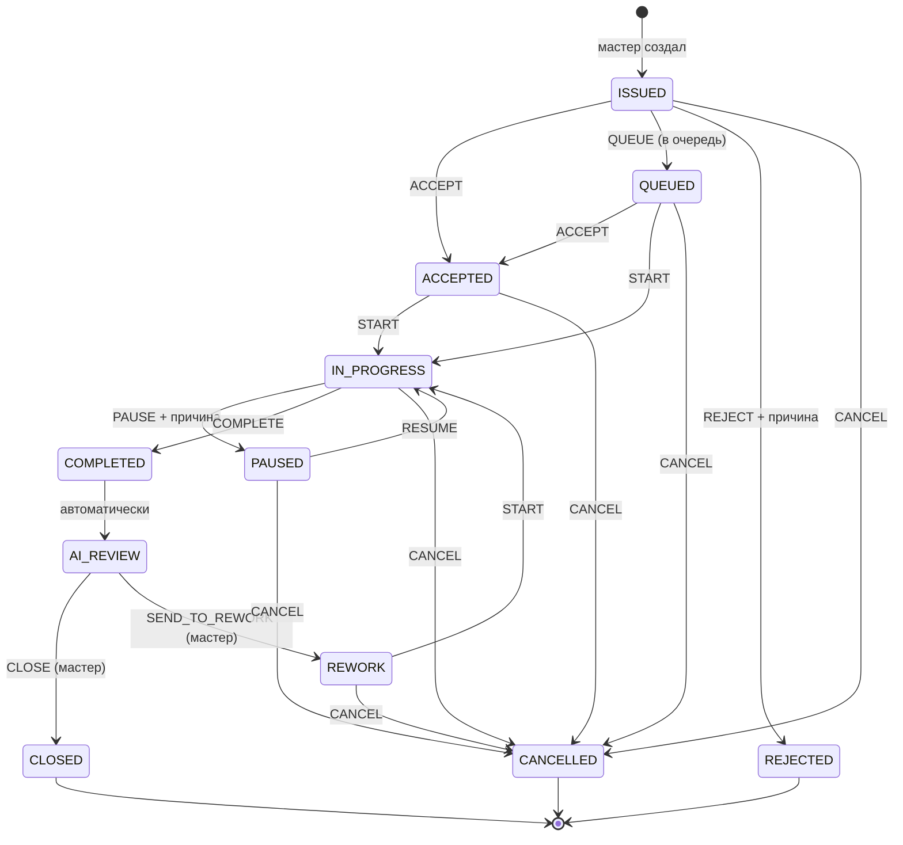
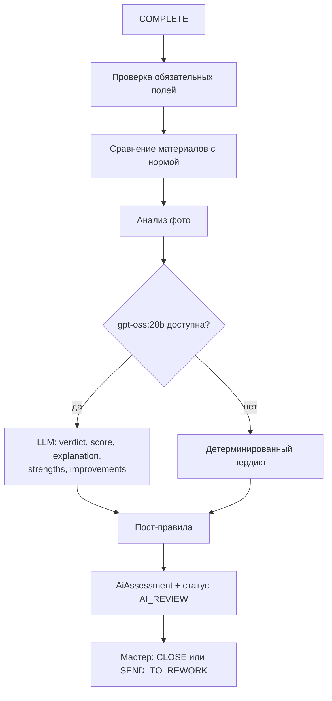

# НарядAI — полное описание функционала backend

> Документ описывает **фактическое** поведение кода (`src/`), а не планы. Каждое правило ниже покрыто автотестом — см. [TESTING_AND_RESEARCH.md](TESTING_AND_RESEARCH.md).
> Версия: `0.1.0`, дата: 05.10.2026.

## Содержание

1. [Назначение и архитектура](#1-назначение-и-архитектура)
2. [Роли и права](#2-роли-и-права)
3. [Модель данных](#3-модель-данных)
4. [Жизненный цикл наряда](#4-жизненный-цикл-наряда)
5. [Создание, правка, переназначение](#5-создание-правка-переназначение)
6. [Статусы сотрудников](#6-статусы-сотрудников)
7. [Офлайн-режим и идемпотентность](#7-офлайн-режим-и-идемпотентность)
8. [Фото: загрузка, сжатие, антиподлог](#8-фото-загрузка-сжатие-антиподлог)
9. [AI-проверка закрытия](#9-ai-проверка-закрытия)
10. [Материалы и нормативы](#10-материалы-и-нормативы)
11. [Контроль сроков и эскалации](#11-контроль-сроков-и-эскалации)
12. [Уведомления: БД, Socket.IO, FCM](#12-уведомления-бд-socketio-fcm)
13. [Голосовой ввод (Whisper)](#13-голосовой-ввод-whisper)
14. [Рекомендации](#14-рекомендации)
15. [AI-помощник мастера](#15-ai-помощник-мастера)
16. [Аналитика: аномалии, прогноз, дашборд](#16-аналитика-аномалии-прогноз-дашборд)
17. [Отчёты и рейтинги](#17-отчёты-и-рейтинги)
18. [Оборудование и QR-коды](#18-оборудование-и-qr-коды)
19. [Справочники и администрирование](#19-справочники-и-администрирование)
20. [Интеграция с 1С / ERP / ТОиР](#20-интеграция-с-1с--erp--тоир)
21. [Работа без AI (деградация)](#21-работа-без-ai-деградация)
22. [Конфигурация](#22-конфигурация)
23. [Развёртывание на сервере](#23-развёртывание-на-сервере)
24. [Полный список API](#24-полный-список-api)
25. [Коды ошибок](#25-коды-ошибок)
26. [Известные ограничения](#26-известные-ограничения)

---

## 1. Назначение и архитектура

НарядAI — система электронных нарядов на ремонт оборудования промышленного предприятия. Мастер выдаёт наряд, исполнитель принимает и выполняет его с телефона, AI проверяет качество закрытия, руководитель видит аналитику и рейтинги.

| Слой | Технология |
|---|---|
| HTTP API | Node.js 22, TypeScript, Express 5 |
| Валидация | Zod 4 |
| БД | MySQL 8.4, Prisma ORM 6 |
| Realtime | Socket.IO 4 |
| Текстовый AI | Ollama, `gpt-oss:20b` (локально, без облака) |
| Vision AI | Ollama, `gemma4:e4b` (опционально) |
| Голос | Whisper large-v3 (`whisper-service`) |
| Push | Firebase Cloud Messaging |
| Отчёты | PDFKit, ExcelJS |
| Фоновые задачи | node-cron: контроль сроков каждую минуту, синхронизация с 1С каждую минуту, AI-сводка по понедельникам в 08:00 |



Все AI-модели работают **на сервере предприятия**: данные нарядов, фото и голос не уходят во внешние облака.

---

## 2. Роли и права

Вход — по номеру телефона и паролю (`POST /api/auth/login { phone, password }`), ответ — JWT на 12 часов (одна смена). Телефон в любой записи (`8 701…`, `+7 (701)…`) приводится к E.164 `+77011234567`. Новый пароль — от 6 символов; пользователь меняет его сам (`POST /api/auth/change-password`), админ сбрасывает через `PATCH /api/admin/users/:id`. Пароль хранится как хеш **scrypt** и никогда не возвращается API. Хеширование идёт в пуле потоков libuv и не блокирует сервер. Старые bcrypt-хеши принимаются и при первом успешном входе прозрачно заменяются на scrypt.

**Защита от перебора пароля:**
- 5 неверных попыток на номер (`LOGIN_MAX_ATTEMPTS`) → номер заблокирован на 15 минут (`LOGIN_LOCK_MINUTES`), даже если затем ввести верный пароль;
- 30 неудач с одного IP (`LOGIN_MAX_ATTEMPTS_PER_IP`) → блокируется IP;
- во время блокировки ответ **429** с заголовком `Retry-After`;
- успешный вход сбрасывает счётчик номера;
- IP берётся из `X-Forwarded-For` только от локального прокси (`trust proxy: loopback`).

Полный перебор даже 4-значного цифрового пароля одного номера занимает около 500 часов вместо 18 минут без блокировки.

| Возможность | Мастер | Исполнитель | Руководитель | Админ |
|---|:-:|:-:|:-:|:-:|
| Создать / изменить / переназначить наряд | ✅ | — | — | ✅ |
| Видеть наряды | все | **только свои** | все | все |
| Принять / в очередь / отклонить / начать / пауза / завершить | ✅ | свои | ✅ | ✅ |
| Закрыть / вернуть на доработку / отменить | ✅ | — | — | ✅ |
| Аналитика, отчёты, рейтинги | ✅ | — | ✅ | ✅ |
| Справочники (чтение) | ✅ | ✅ | ✅ | ✅ |
| Справочники (запись), пользователи, смены | — | — | — | ✅ |
| Мониторинг интеграции с 1С | — | — | ✅ | ✅ |
| AI-помощник, голос, рекомендации, загрузка фото | ✅ | ✅ | ✅ | ✅ |

У каждого пользователя есть поле `language` (`ru` / `kk`): клиент показывает интерфейс на русском или казахском.

---

## 3. Модель данных



| Сущность | Назначение |
|---|---|
| `Area` | производственный участок |
| `Equipment` | оборудование: инвентарный номер, тип, критичность 1–5, уникальный QR-токен |
| `Brigade` | бригада |
| `User` | сотрудник: роль, специальность, разряд, статус, «на смене», язык |
| `FaultCode` | шифр неисправности (код, название, категория) |
| `Material` | материал и единица измерения |
| `WorkNormative` + `MaterialNorm` | норматив: часы на работу и нормы расхода материалов для типа оборудования или конкретной единицы, а также для шифра |
| `WorkOrder` | наряд: тип, приоритет, срок, статус, все временные метки, причины паузы и отказа, фактический простой, бригада (если выдан бригаде) |
| `WorkOrderEvent` | неизменяемый журнал действий: кто, что, из какого статуса в какой, `clientActionId` |
| `Photo` | фото до/после, SHA-256, перцептивный хеш, метаданные, AI-оценка |
| `MaterialUsage` | фактический расход материалов по наряду |
| `AiAssessment` | вердикт AI, балл, объяснение, сильные стороны и замечания, оценка фото, флаг «нужна проверка мастером», оценка мастера |
| `EquipmentDowntime` | период простоя (открывается аварийным нарядом) |
| `Notification`, `PushDevice` | уведомления и FCM-токены устройств |
| `AnomalyInsight` | найденные аномалии с доказательствами |
| `AssistantMessage` | история диалога с AI-помощником |
| `IntegrationMapping`, `IntegrationJob` | сопоставление ID с 1С и очередь обмена |

---

## 4. Жизненный цикл наряда



- Все 10 действий выполняются через `POST /api/work-orders/:id/action` с полем `{ action }`.
- Допустимо **18 переходов из 110 возможных** пар «действие × статус». Остальные отклоняются с кодом **409** и текстом вида «Переход START недоступен из статуса CLOSED».
- `REJECT` и `PAUSE` без `comment` → **400**: причина обязательна.
- `COMPLETE` принимает `completionText`, `faultCodeId`, до 5 `afterPhotoUrls` и `materials[]`. Сразу после этого запускается AI-проверка, наряд переходит в `AI_REVIEW`, а ответ содержит `assessment`.
- `CLOSE` принимает `masterScore` (1–5), `comment`, `actualDowntimeMinutes` и закрывает открытый простой оборудования. Если AI-оценки нет (например, наряд импортирован из 1С сразу в `AI_REVIEW`), сохраняется оценка мастера с пометкой «без AI-проверки».
- При повторном `START` после доработки исходное `startedAt` сохраняется.
- `CANCEL` доступен мастеру из любого незавершённого статуса, включая `IN_PROGRESS` и `REWORK`; открытый простой оборудования закрывается.
- `POST /:id/comment { comment }` — комментарий без смены статуса (событие `COMMENT`): исполнитель — к своему наряду, мастер — к любому. Поддерживает `clientActionId`.
- Каждое действие пишет событие в журнал, рассылает `work-order:changed` по Socket.IO, пересчитывает статус исполнителя и ставит задание в очередь 1С.

Временные метки: `createdAt → acceptedAt → startedAt → completedAt → closedAt`. По ним считаются время реакции и время выполнения.

---

## 5. Создание, правка, переназначение

**Создание** (`POST /api/work-orders`, мастер или админ):

| Поле | Правило |
|---|---|
| `type` | `PLANNED` (плановый) или `EMERGENCY` (аварийный) |
| `priority` | `EMERGENCY` > `HIGH` > `NORMAL` > `PLANNED` |
| `description` | не короче 3 символов |
| `areaId` + `equipmentId` | оборудование обязано принадлежать участку, иначе 400 |
| `assigneeId` **или** `brigadeId` | исполнитель с ролью `EXECUTOR` или бригада. Только `brigadeId` — старшим назначается лучший по подбору (§14) член бригады на смене, остальным приходит `BRIGADE_ORDER`; в бригаде никого на смене → 400. Оба поля — исполнитель обязан состоять в бригаде |
| `deadline` или `normativeId` | обязательно одно из двух; без явного срока он равен `сейчас + часы норматива` |
| `beforePhotoUrls` | не больше 5 |

Номер присваивается автоматически: `N-xxxxxxxx`. Аварийный наряд **сразу открывает период простоя оборудования**. Исполнитель получает уведомление `NEW_ORDER`; для аварийного используется отдельный звуковой канал push `emergency_orders`.

**Правка** (`PATCH /:id`): приоритет, срок, комментарий; в журнал пишется событие `EDIT`; несуществующий наряд → 404.
**Переназначение** (`POST /:id/reassign`):
- наряд возвращается в `ISSUED`, новый исполнитель получает уведомление, статусы обоих исполнителей пересчитываются;
- переназначить можно только на пользователя с ролью `EXECUTOR`, иначе 400;
- наряды в статусах `COMPLETED`, `AI_REVIEW`, `CLOSED`, `CANCELLED` переназначить нельзя → 409; отклонённый (`REJECTED`) можно;
- прежний исполнитель получает realtime-событие, чтобы наряд исчез из его очереди.

Список `GET /api/work-orders`:
- фильтры `status` и `priority` (через запятую), `type`, `areaId`, `equipmentId`, `assigneeId`, `brigadeId`, `overdue=1`; неизвестное значение → 400;
- у каждого наряда признак `isOverdue`;
- сортировка по приоритету, затем по сроку;
- пагинация `limit` (1–500, по умолчанию 200) и `offset`, общее число записей — в заголовке `X-Total-Count`;
- `compact=1` возвращает облегчённый список без фото и строк материалов, для очереди на телефоне.

**Панель смены** `GET /api/work-orders/board` (кейс, 5.2): колонки канбана `issued`, `accepted`, `inProgress` (+ пауза и доработка), `queued`, `completed` (+ на проверке и закрытые за смену), `overdue` и счётчики смены `issued`, `completed`, `overdue`, `equipmentInDowntime`. Фильтры как у списка, `hours` — длина смены (12).

**Отчёт по наряду** `GET /api/work-orders/:id/report` (кейс, 6.4): исполнителю — оценка (итоговая: мастера, иначе AI), что хорошо, что улучшить, время против норматива; мастеру — полная карточка, хронология, фото до/после, вердикт AI, простой. Карточка `GET /:id` тоже содержит `timing`: норматив, факт, % от норматива, уложился ли в срок.

---

## 6. Статусы сотрудников

Пересчитываются автоматически после каждого действия по наряду:

| Статус | Условие |
|---|---|
| `OFF_SHIFT` | не на смене |
| `AVAILABLE` | на смене, активных нарядов нет |
| `BUSY` | есть наряд в работе (`ACCEPTED`, `IN_PROGRESS`, `PAUSED`, `REWORK`) |
| `QUEUED` | есть ожидающие наряды (`ISSUED`, `QUEUED`), в том числе одновременно с работой |

`GET /api/references/executors` отдаёт для выбора исполнителя готовую подпись `statusText` («свободен», «выполняет наряд №…, в очереди N», «в очереди N нарядов», «не на смене»), текущий наряд `currentOrder` и длину очереди `queue`; фильтры `specialty`, `brigadeId`, `onShift`.

---

## 7. Офлайн-режим и идемпотентность

На участке может пропадать связь, поэтому мобильный клиент копит действия в локальной очереди и отправляет их повторно. Каждое действие несёт уникальный `clientActionId` длиной 8–100 символов:

- если событие с таким `clientActionId` уже есть, сервер **ничего не меняет** и отвечает `{ order, replayed: true }`;
- уникальность гарантирует БД. Если несколько повторов пришли одновременно, проигравшие гонку тоже получают `200 { replayed: true }`, а не ошибку: 20 параллельных повторов дают 20 ответов 200 и ровно одно событие (проверено тестом).

---

## 8. Фото: загрузка, сжатие, антиподлог

`POST /api/uploads` (multipart, поле `file`, до 15 МБ):

- изображения автоматически поворачиваются по EXIF, ужимаются до **1600 px** по длинной стороне и перекодируются в JPEG q80;
- из метаданных сохраняется **только время съёмки** (EXIF `DateTimeOriginal`/`DateTime`, иначе поле формы `takenAt`), остальное (GPS, модель телефона) удаляется; ответ содержит `takenAt`;
- ответ: `{ url: "/uploads/…?exp=…&sig=…" }`, этот URL передаётся в `beforePhotoUrls` / `afterPhotoUrls`; в БД подпись не сохраняется.

**Доступ к файлам.** `/uploads/*` отдаётся только по подписанной ссылке (HMAC, срок `UPLOAD_URL_TTL_HOURS`, по умолчанию 7 дней) или с заголовком `Authorization: Bearer`. API подписывает все ссылки `/uploads/…` во всех JSON-ответах и событиях Socket.IO, поэтому `` в клиенте работает без изменений. Без подписи — 401; подпись привязана к конкретному файлу.

Анализ фото при закрытии наряда:

| Проверка | Результат |
|---|---|
| Нет фото «после» | балл 1 |
| Фото «после» снято **раньше выдачи наряда** (по времени съёмки, допуск 5 мин) | балл 1, старый снимок → доработка |
| Фото «после» снято **до начала работ** | балл 3, уверенность 0.4, «нужна проверка мастером» |
| То же фото (SHA-256) уже использовано в **другом** наряде | балл 1, дубликат → доработка |
| Есть только фото «после» | балл 3, уверенность 0.45 |
| Фото «после» похоже (≥ 0.88) на фото из **прошлого наряда по этому же оборудованию** | балл 3, уверенность 0.4, «проверьте, что снимок новый» — решает мастер |
| Фото до и после совпадают байт в байт **или** сходство ≥ 0.98 | балл 1, дубликат → доработка |
| Сходство фото до и после 0.88–0.98 | балл 3, уверенность 0.4, «проверьте, что ремонт виден на снимке» — решает мастер |
| Включена vision-модель | Ollama получает оба фото и возвращает `score`, `confidence`, `sameEquipment`, `problemFixed`, `safetyIssues` |
| — `sameEquipment = false` | балл 1, «на фото другое оборудование» |
| — найдены замечания безопасности | балл не выше 2 |
| Vision выключен или сбоит | балл 4, уверенность 0.55, «требуется проверка мастером» |

Перцептивный хеш: снимок уменьшается до 16×16 в оттенках серого, каждый пиксель сравнивается со средней яркостью, получается 256 бит; сходство — доля совпавших бит. Хеш и метаданные (размер, формат, ориентация) сохраняются в `Photo`.

Пороги взяты из исследования R4:
- **0.98** — автоматическая доработка, там почти наверняка тот же снимок;
- **0.88** — у разных фото сходство не превышало 0.84, поэтому всё выше уходит **мастеру на проверку**: фото одного и того же оборудования с одной точки могут быть похожи и на самом деле.

Поиск по прошлым нарядам охватывает последние 300 фото этой единицы оборудования. Он ловит повторную загрузку старого снимка после обрезки, пережатия или изменения яркости.

---

## 9. AI-проверка закрытия

Запускается автоматически на `COMPLETE`. Работает как конвейер «**жёсткие правила → LLM → жёсткие правила**», поэтому LLM не может ослабить обязательные требования.



LLM получает: описание проблемы, текст отчёта, оборудование, шифр, материалы, наличие фото, результат анализа фото, нормативные и фактические часы, предупреждения по материалам, список незаполненных полей.

Системный промпт (`REVIEW_PROMPT` в `ai-review.ts`) перечисляет явные критерии доработки:
- нет конкретных действий («сделано», «всё ок»);
- работа не выполнена или отложена;
- отчёт не относится к проблеме;
- проблема осталась;
- нарушены безопасность или технология;
- бессмысленный текст.

Промпт требует отвечать только по-русски и не принимать работу только из-за фото. В реальном конвейере он даёт **97.2%** верных вердиктов и находит **100%** плохих отчётов против 77.8% и 58% у прежнего однострочного; на отложенном наборе — тоже 97.2% (см. исследование R1).

**Пост-правила** применяются поверх ответа LLM:

1. Не заполнены описание работ, шифр неисправности или фото «после» (для аварийного наряда) → `REWORK_REQUIRED`, балл не выше 2.
2. **Нарушение безопасности в тексте отчёта** → `REWORK_REQUIRED`, балл 1, с цитатой в объяснении. Правило жёсткое и не зависит от LLM: «отключил / обошёл / замкнул / шунтировал / перемкнул … защиту / блокировку / заземление / концевик», «без заземления / допуска / наряда-допуска». Обычная процедура («отключил питание, заменил автомат») нарушением не считается.
3. Расход материала **больше 150% нормы** → `ACCEPTED` понижается до `ACCEPTED_WITH_COMMENTS` с указанием материала.
4. Фото-дубликат, старый снимок или фото-балл не выше 2 → `REWORK_REQUIRED`. Отсутствие фото «после» у **планового** наряда доработку не вызывает: фото обязательно только для аварийных.
5. Балл приводится к целому в диапазоне 1–5.
6. **Низкая уверенность** — похожие фото, фото снято до начала работ, уверенность vision-модели < 0.5, vision или LLM недоступны → `needsMasterReview = true`, объяснение начинается с «Нужна проверка мастером.». Вердикт остаётся подсказкой, решает мастер (кейс, 6.3.4).

Вердикты: `ACCEPTED` — принято, `ACCEPTED_WITH_COMMENTS` — принято с замечаниями, `REWORK_REQUIRED` — нужна доработка. **Окончательное решение всегда за мастером**: он закрывает наряд или возвращает его на доработку и ставит свою оценку 1–5. Оценка мастера приоритетнее AI-оценки во всех рейтингах.

---

## 10. Материалы и нормативы

- Норматив задаёт часы и нормы материалов для типа оборудования, конкретной единицы или шифра неисправности.
- При закрытии исполнитель указывает фактический расход; повторная отправка обновляет количество (upsert), а не дублирует строку.
- Перерасход больше 150% нормы отмечается в AI-проверке, системный перерасход выявляется аналитикой (§16).

---

## 11. Контроль сроков и эскалации

Проверка запускается каждую минуту для нарядов в статусах `ISSUED`, `ACCEPTED`, `QUEUED`, `IN_PROGRESS`, `PAUSED`:

| Событие | Кому | Повтор |
|---|---|---|
| До срока ≤ 30 мин (`DEADLINE_REMINDER_MINUTES`) | исполнителю | один раз |
| Срок прошёл | исполнителю и мастеру | каждые 30 мин (`OVERDUE_0`, `OVERDUE_1`, …) |
| Просрочка ≥ 120 мин (`LONG_OVERDUE_MINUTES`) | всем руководителям на смене | каждые 30 мин |
| Аварийный наряд не принят за 3 мин / обычный за 10 мин | мастеру: кого переназначить — лучший свободный по подбору (§14), его id в push `suggestedExecutorId` | один раз |

Контролируются наряды в статусах `ISSUED`, `ACCEPTED`, `QUEUED`, `IN_PROGRESS`, `PAUSED`, `REWORK`; непринятые проверяются независимо от срока. Каждое уведомление создаётся не больше одного раза на тип и наряд, поэтому повторные прогоны cron не дублируют сообщения.

Текст напоминания и просрочки содержит всё, что требует кейс (6.1): «Наряд №Н-00147 просрочен на 45 мин. Дробилка КМД-1750 (Д-2), участок дробление. Исполнитель: Ахметов Е. Статус: в работе с 09:20. Последний комментарий: “ждём подшипник со склада”.» Последний комментарий — из журнала (`COMMENT`, причина паузы и т. п.). Время — в часовом поясе предприятия `APP_TIMEZONE`.

**Еженедельная AI-сводка** (понедельник, 08:00): поиск аномалий за 7 дней, LLM формирует краткий вывод, его получают мастера и руководители на смене.

---

## 12. Уведомления: БД, Socket.IO, FCM

Каждое уведомление проходит три канала:

1. **БД.** Лента `GET /api/notifications`, отметка о прочтении `PATCH /:id/read`; отметить можно только свои уведомления.
2. **Socket.IO.** Подключение требует JWT в `auth.token`; сокет попадает в комнаты `user:<id>` и `role:<роль>`.
   - `notification:new` получает только адресат.
   - `work-order:changed` получают мастера, руководители, админы и **только исполнитель этого наряда**, а при переназначении — ещё и прежний исполнитель. Чужие наряды исполнителю не приходят, так же как в REST.
3. **FCM push.** Отправляется на все устройства пользователя, зарегистрированные через `POST /api/devices` (android / ios / web). Аварийные наряды идут в Android-канал `emergency_orders` и iOS-категорию `EMERGENCY_ORDER`. Без `FIREBASE_SERVICE_ACCOUNT_JSON` push отключён, остальные каналы работают.

---

## 13. Голосовой ввод (Whisper)

`POST /api/ai/transcribe` (multipart, поле `audio`, до 25 МБ) → `{ text }`. Подходит для надиктовки описания проблемы и отчёта о работе.

- Поддерживаются оба протокола: локальный `whisper-service` (`/transcribe`, поле `file`, `?language=ru`) и OpenAI-совместимый `/v1/audio/transcriptions`. Протокол определяется по `WHISPER_URL`.
- Речь не распознана → **422**, Whisper недоступен → **502**. Временный файл удаляется в любом случае.
- На сервере работает Whisper large-v3 на GPU: около 0.6 с на фразу. Качество распознавания — в исследовании R3.

---

## 14. Рекомендации

**Исполнитель для оборудования** (`GET /api/recommendations/executors?equipmentId=&description=&faultCodeId=&specialty=&brigadeId=`) — только исполнители на смене. **Сначала — нужной специальности**, внутри — по баллу. Специальность: явный `specialty` → категория шифра (`Э` — электрик; `М`, `Г`, `П`, `С` — слесарь) → слова описания (двигатель, кабель, пускатель… — электрик; сварка, трещина… — сварщик; иначе слесарь). Без подсказок специальность не учитывается.

```
балл = доступность + 8 × рейтинг_на_этом_типе_оборудования − 3 × размер_очереди
доступность: AVAILABLE = 50, QUEUED = 20, BUSY = 0
рейтинг = средняя (оценка мастера ?? AI-оценка) по закрытым нарядам на этом типе, по умолчанию 3
```

**Шифр и норматив по описанию** (`POST /api/recommendations/work`): LLM выбирает `faultCodeId`, `normativeId`, `estimatedHours` **только из переданных справочников** — подходящих оборудованию по id или типу. Без LLM возвращается первый подходящий норматив.

---

## 15. AI-помощник мастера

`POST /api/assistant/chat { message }` → `{ answer, intent, data }`. История: `GET /api/assistant/history`.

Безопасная схема **без произвольного SQL**:

1. LLM только **классифицирует** вопрос в одно из 6 намерений и извлекает параметры (`specialty`, `equipmentQuery`). В промпте по 2–3 примера на каждое намерение на русском и казахском (few-shot), они разводят пограничные случаи «аномалии / история / прогноз».
2. Данные достаёт **заранее написанный запрос** для этого намерения.
3. LLM формулирует ответ **только по этим данным** («не выдумывай»).

| Намерение | Пример вопроса | Данные |
|---|---|---|
| `FREE_EXECUTORS` | «Кто свободен из электриков?» | свободные исполнители на смене, фильтр по специальности |
| `OVERDUE` | «Что просрочено?» | незакрытые наряды с истёкшим сроком |
| `EQUIPMENT_HISTORY` | «История конвейера К-3» | наряды по оборудованию, найденному по названию |
| `SHIFT_REPORT` | «Как прошла смена?», «Отчёт за неделю по участку обогащения» | отчёт за смену (§17) за период и по участку |
| `ANOMALIES` | «Покажи аномалии» | поиск аномалий |
| `FAILURE_FORECAST` | «Дай прогноз отказов» | прогноз отказов |

Участок и период извлекаются из вопроса (LLM — `areaQuery`, `periodDays`; без LLM — по корням названий участков и словам «смена», «сутки», «неделя», «месяц», «квартал»). Ими фильтруются отчёт, просрочки, аномалии и прогноз: «Покажи проблемы участка дробления за месяц» → аномалии за 30 дней по участку.

Без LLM работает классификация по словарю корней, включая казахские («свобод», «бос», «просроч», «горит», «мерзім», «прогноз», «риск», «болжам», «аномал», «повторя», «ауытқу», «истори», «тарих», «смен», «ауысым» и др.). Из вопроса извлекаются специальность и номер оборудования (`К-3`), а ответ отдаётся сырыми данными.

---

## 16. Аналитика: аномалии, прогноз, дашборд

**Поиск аномалий** (`POST /api/analytics/anomalies/run`, по умолчанию за 90 дней; `GET /api/analytics/anomalies`):

| Тип | Условие | Важность |
|---|---|---|
| `FREQUENT_FAILURES` | закрытых нарядов на единицу ≥ max(3, 1.8 × среднее по оборудованию) | 4, при > 3× среднего — 5 |
| `REPEATED_FAULT` | один шифр ≥ 3 раз **и** ≥ 40% всех ремонтов этой единицы | 4 |
| `FAILURE_AFTER_PLANNED_MAINTENANCE` | ≥ 2 аварийных наряда в течение 7 дней после ППР **и** их доля на один ППР ≥ max(0.3, 2 × доля по остальному парку) | 5 |
| `MATERIAL_ANOMALY` | списание больше 2 × нормы из норматива наряда; для списаний без норматива — ≥ 3 списаний и максимум > 2 × среднего | 3 |
| `AREA_HOTSPOT` | участок: ≥ 5 аварий и аварий **или** простоя на единицу оборудования ≥ 1.5 × среднего по другим участкам | 4 |
| `SHIFT_PATTERN` | ≥ 10 аварий, ≥ 70% в одной смене (смены по `DAY_SHIFT_START_HOUR`–`DAY_SHIFT_END_HOUR`) | 3 |
| `TIME_OF_DAY` | ≥ 10 аварий, ≥ 45% в одном 6-часовом интервале суток | 3 |
| `EXECUTOR_REPEAT_FAILURES` | после ≥ 3 ремонтов исполнителя та же неисправность (шифр) на том же оборудовании вернулась за 7 дней, доля ≥ max(25%, 2 × у остальных) **и** такое число повторов маловероятно случайно (биномиальный тест, p < 0.01) | 4 |
| `BRIGADE_REPEAT_FAILURES` | то же по бригаде, доля ≥ max(20%, 1.5 × у остальных бригад), p < 0.01 | 3 |

`FAILURE_AFTER_PLANNED_MAINTENANCE` дополнительно сравнивает отказы после ППР с собственной частотой отказов единицы: оборудование, которое ломается постоянно, не считается «отказывающим после ППР» (нужно ≥ 2 × ожидаемого случайно).

Время суток и смена считаются в часовом поясе предприятия. Запуск и `GET /anomalies` принимают `areaId`: возвращаются аномалии участка и общие.

У каждой аномалии есть доказательства (`evidence`) и рекомендация. Повторный запуск за тот же период перезаписывает результаты, а не дублирует их. LLM добавляет к результатам краткую сводку.

**Прогноз отказов** (`GET /api/analytics/failure-forecast?days=30`):

```
рост = min(1, (недавние + 1) / (предыдущие + 1) − 1)      — сглаживание Лапласа, рост не больше 100%
недавние / предыдущие = аварии за последние N дней / за N дней до них
вероятность = clamp(0.15 + 0.08 × недавние + 0.25 × max(0, рост) + 0.04 × критичность, 0.05, 0.95)
```

**Дашборд** (`GET /api/analytics/dashboard`): активные и просроченные наряды, оборудование в простое, среднее время реакции (создан → принят) и выполнения (начат → завершён) за 30 дней, топ-5 оборудования по авариям, участки по авариям на единицу оборудования (`topAreas`), топ-5 исполнителей по качеству.

---

## 17. Отчёты и рейтинги

Все отчёты и выгрузки принимают одни фильтры: `period` (`shift` 12 ч, `day`, `week`, `month` 30 дней) или `from`/`to`, а также `areaId`, `equipmentId`, `executorId`, `brigadeId`. По умолчанию отчёт за смену — 12 ч, остальные — 30 дней.

| Отчёт | Содержание |
|---|---|
| `GET /api/reports/shift` | выдано / выполнено / закрыто / просрочено / отклонено / отменено, загрузка людей (`load`, `workload`), простои (`downtime`), AI-сводка (без LLM — шаблонный текст) |
| `GET /api/reports/ratings` | рейтинг исполнителей (формула ниже) с баллами по частям и пояснением |
| `GET /api/reports/my-rating` | рейтинг текущего исполнителя |
| `GET /api/reports/brigade-ratings` | 70% качество + 30% соблюдение сроков; доля повторных отказов |
| `GET /api/reports/materials[?groupBy=material\|area\|equipment\|executor]` | количество по материалам и группам, сумма норм, отклонение от нормы в %, списания сверх 150% нормы |
| `GET /api/reports/downtime` | простой по каждой единице: минуты, причины по шифрам, доля плановых и внеплановых; итоги и список случаев |
| `GET /api/reports/work-order/:id` и `…/:id.pdf` | полная карточка наряда, хронология, timing; PDF |
| `GET /api/reports/export.xlsx?report=…` | Excel любого отчёта: `orders` (по умолчанию), `shift`, `ratings`, `brigades`, `materials`, `downtime`, `anomalies` |
| `GET /api/reports/export.pdf?report=…` | PDF тех же отчётов (шрифт DejaVu с кириллицей) |

**Рейтинг исполнителя (0–100)** — прозрачная формула, баллы по частям (`points`) и пояснение исполнителю (`explanation`) возвращаются в ответе:

```
45 × качество/5          (качество = средняя оценка мастера ?? AI)
+ 25 × доля в срок
+ 15 × (1 − доля возвратов)                  — возврат: мастер вернул на доработку или та же неисправность на том же оборудовании повторилась за 7 дней; 0, если закрытых нет
+ 10 × min(1, закрыто/20)
+ min(5, число аварийных и срочных)          — бонус за сложность
− 2 × необоснованные отказы                  — отказ без слов «материал», «допуск», «аварийн», «безопасн», «смен», «запчаст», «инструмент», «болезн»
```

Пояснение строится по формуле: сколько баллов дала каждая часть и где можно добавить больше всего («…Больше всего баллов можно добавить, если устранять причину поломки, чтобы оборудование не возвращалось в ремонт»).

---

## 18. Оборудование и QR-коды

- `GET /api/equipment/:id/qr.png` — QR 512×512 со ссылкой `PUBLIC_APP_URL/equipment/<qrToken>` для наклейки на оборудование.
- `GET /api/equipment/qr/:token` — карточка оборудования по отсканированному токену: исполнитель сканирует QR и сразу видит единицу.
- `GET /api/equipment/:id/history` — все наряды с шифрами, AI-оценками, простоями и материалами.

---

## 19. Справочники и администрирование

Чтение (все роли): `GET /api/references/areas | equipment[?areaId] | fault-codes | materials | brigades | normatives[?equipmentId] | executors[?specialty&brigadeId&onShift]`. Справочник исполнителей включает статус, подпись `statusText`, текущий наряд, длину очереди и бригаду.

Админ: создание и правка участков, оборудования, шифров, материалов, бригад, нормативов вместе с нормами материалов, пользователей; управление сменой `PATCH /api/admin/users/:id/shift`; удаление `DELETE /api/admin/:resource/:id`.

---

## 20. Интеграция с 1С / ERP / ТОиР

**Входящий обмен** — 1С вызывает НарядAI с заголовком `x-1c-api-key`, ключ сравнивается за постоянное время:

- `POST /api/integrations/1c/import { requestId, entity, items[] }`, где `entity` — `AREA`, `BRIGADE`, `FAULT_CODE`, `MATERIAL`, `EQUIPMENT`, `EMPLOYEE`, `NORMATIVE` или `WORK_ORDER`, до 1000 элементов;
- связи передаются внешними ID (`areaExternalId`, `assigneeExternalId`, …), сопоставление хранится в `IntegrationMapping`;
- повтор того же `requestId` возвращает сохранённый ответ без повторного импорта;
- ошибка в элементе → **422** с `externalId` проблемного элемента, например «Элемент E9: Не найден участок 1С NOPE», задание помечается `FAILED`;
- сотрудник из 1С может прийти с `phone` (нормализуется, неверный → 422); пароль назначается случайный, рабочий задаёт админ;
- `GET /api/integrations/1c/ping` — проверка связи.

**Исходящий обмен** — каждое изменение наряда ставит задание в очередь `IntegrationJob`:

- раз в минуту задания отправляются `POST` на `ONE_C_BASE_URL + ONE_C_PUSH_PATH` с заголовком `x-idempotency-key`;
- в теле — полный наряд с внешними ID, материалами, AI-оценкой и журналом;
- если 1С вернул `externalId`, он сохраняется;
- при ошибке задание повторяется с задержкой **2, 4, 8, 16, 32, 60 мин**, после `ONE_C_MAX_ATTEMPTS` попыток получает статус `DEAD`;
- мониторинг и управление (админ, руководитель): `GET /1c/jobs`, `GET /1c/mappings`, `POST /1c/run`, `POST /1c/jobs/:id/retry`, `POST /1c/push/orders`, а также выгрузка `GET /api/integrations/orders?since=` в JSON.

---

## 21. Работа без AI (деградация)

При `AI_STRICT=false` (по умолчанию) недоступность Ollama не ломает ни одну функцию:

| Функция | Без LLM |
|---|---|
| AI-проверка | при незаполненных полях — `REWORK_REQUIRED`, иначе `ACCEPTED_WITH_COMMENTS` (4) с пометкой «проверить мастером» |
| Помощник | ключевые слова + сырые данные |
| Рекомендация шифра и норматива | первый подходящий норматив |
| Сводки (смена, аномалии, неделя) | шаблонный текст |
| Vision | эвристика по хешам |

`GET /health/ready` возвращает 503, если Ollama недоступна. Это удобно для мониторинга.

---

## 22. Конфигурация

| Переменная | По умолчанию | Назначение |
|---|---|---|
| `PORT` | 8765 | порт API |
| `DATABASE_URL` | — | строка подключения MySQL |
| `JWT_SECRET` | — | секрет JWT, не короче 16 символов |
| `OLLAMA_URL` / `OLLAMA_MODEL` | `http://localhost:11434` / `gpt-oss:20b` | текстовая LLM |
| `OLLAMA_VISION_MODEL` | пусто | vision-модель (на сервере `gemma4:e4b`) |
| `WHISPER_URL` / `WHISPER_MODEL` | — / `whisper-1` | распознавание речи |
| `AI_STRICT` | `false` | `true` — ошибка LLM делает действие неуспешным |
| `DEADLINE_REMINDER_MINUTES` / `OVERDUE_REPEAT_MINUTES` / `LONG_OVERDUE_MINUTES` | 30 / 30 / 120 | контроль сроков |
| `FIREBASE_SERVICE_ACCOUNT_JSON` | пусто | ключ FCM |
| `PUBLIC_APP_URL` | `http://localhost:8765` | база ссылок в QR |
| `ONE_C_*` | выключено | интеграция с 1С |
| `LOGIN_MAX_ATTEMPTS` / `LOGIN_MAX_ATTEMPTS_PER_IP` / `LOGIN_LOCK_MINUTES` | 5 / 30 / 15 | защита от перебора пароля |
| `UPLOAD_URL_TTL_HOURS` | 168 | срок действия подписанных ссылок на фото |
| `APP_TIMEZONE` | `Asia/Qostanay` | часовой пояс предприятия: тексты уведомлений, смены, время суток, EXIF |
| `DAY_SHIFT_START_HOUR` / `DAY_SHIFT_END_HOUR` | 8 / 20 | границы дневной смены для аналитики |

---

## 23. Развёртывание на сервере

```
docker-compose.server.yml
├─ mysql  (mysql:8.4, 127.0.0.1:3407, volume naryad-ai_mysql_data)
└─ api    (network_mode: host, :8765, ./uploads примонтирован)
    ├─ Ollama          127.0.0.1:11434   (общий сервис сервера)
    └─ whisper-service 127.0.0.1:8090    (общий сервис сервера, large-v3, GPU)
```

```bash
docker compose -f docker-compose.server.yml up -d --build    # сборка + миграции при старте
docker compose -f docker-compose.server.yml exec -e SEED_PASSWORD=<пароль> api npm run db:seed   # ⚠ стирает данные, ставит демо
docker compose -f docker-compose.server.yml logs -f api
```

Контейнеры запущены с `restart: unless-stopped` и поднимаются после перезагрузки сервера.

Демо-пользователи входят по телефонам `+77000000001` и `+77000000004` (мастера), `+77000000002` (руководитель), `+77000000003` (админ) и `+77000000101`–`+77000000115` (исполнители). Без `SEED_PASSWORD` seed выдаёт каждому случайный 6-значный пароль и пишет список в `demo-credentials.local.txt` (права 600, в git не попадает; путь меняется `SEED_CREDENTIALS_FILE`).

**Демо-данные** (`npm run db:seed`, кейс, раздел 8): 4 участка, 25 единиц оборудования с реальными названиями, 2 мастера, 15 исполнителей в 3 бригадах, 21 шифр (М, Э, Г, П, С), 40 материалов, нормативы на типовые работы и ППР, 500+ нарядов за 90 дней с журналом, материалами, простоями и оценками. Заложенные закономерности, которые находит аналитика:
1. Конвейер К-3 ломается примерно в 3 раза чаще, в основном шифр М-02 (подшипник) → `FREQUENT_FAILURES`, `REPEATED_FAULT`;
2. после ремонтов Жумабаева Д. та же неисправность возвращается в течение недели → `EXECUTOR_REPEAT_FAILURES`;
3. насос ГрАТ 1400/40 отказывает через 1–4 дня после каждого ППР → `FAILURE_AFTER_PLANNED_MAINTENANCE`;
4. на мельнице МШЦ-4500 футеровочные болты иногда списываются втрое сверх нормы → `MATERIAL_ANOMALY`;
5. большинство аварий — ночью, пик 00:00–06:00 → `SHIFT_PATTERN`, `TIME_OF_DAY`.

Плюс текущая смена для живого демо: наряды в работе, на паузе, в очереди, на проверке; просроченный наряд на КМД-1750 у Ахметова Е. с комментарием «ждём подшипник со склада»; свободные слесари и электрики.

---

## 24. Полный список API

| Метод | Путь | Роли |
|---|---|---|
| GET | `/health`, `/health/ready` | — |
| POST | `/api/auth/login` | — |
| GET | `/api/auth/me` | все |
| GET, POST | `/api/work-orders[?status,priority,type,areaId,equipmentId,assigneeId,brigadeId,overdue,limit,offset,compact]` | все / мастер, админ |
| GET | `/api/work-orders/board` | все (исполнитель — свои) |
| GET | `/api/work-orders/:id/report` | все (исполнитель — свой) |
| POST | `/api/work-orders/:id/comment` | все (исполнитель — свой) |
| GET, PATCH | `/api/work-orders/:id` | все / мастер, админ |
| POST | `/api/work-orders/:id/action` | по действию |
| POST | `/api/work-orders/:id/reassign` | мастер, админ |
| POST | `/api/uploads` | все |
| POST | `/api/ai/transcribe` | все |
| GET | `/api/references/{areas,equipment,fault-codes,materials,brigades,normatives,executors}` | все |
| GET | `/api/equipment/:id/qr.png`, `/api/equipment/qr/:token`, `/api/equipment/:id/history` | все |
| GET | `/api/recommendations/executors` | все |
| POST | `/api/recommendations/work` | все |
| POST | `/api/assistant/chat` | все |
| GET | `/api/assistant/history` | все |
| GET | `/api/notifications` | все |
| PATCH | `/api/notifications/:id/read` | все |
| POST, DELETE | `/api/devices`, `/api/devices/:token` | все |
| GET | `/api/analytics/dashboard`, `/anomalies`, `/failure-forecast` | мастер, руководитель, админ |
| POST | `/api/analytics/anomalies/run` | мастер, руководитель, админ |
| GET | `/api/reports/my-rating` | все |
| GET | `/api/reports/{shift,ratings,brigade-ratings,materials,downtime,work-order/:id,work-order/:id.pdf,export.xlsx,export.pdf}` | мастер, руководитель, админ |
| GET | `/api/admin/users` | админ |
| POST, PATCH, DELETE | `/api/admin/{areas,equipment,fault-codes,materials,brigades,normatives,users}` | админ |
| PATCH | `/api/admin/users/:id/shift` | админ |
| POST | `/api/integrations/1c/import`; GET `/1c/ping` | ключ 1С |
| GET, POST | `/api/integrations/{orders,1c/jobs,1c/mappings,1c/run,1c/jobs/:id/retry,1c/push/orders}` | руководитель, админ |

Socket.IO: `io(URL, { auth: { token } })`, события `work-order:changed`, `notification:new`.

---

## 25. Коды ошибок

| Код | Когда |
|---|---|
| 400 | ошибка валидации (Zod) или бизнес-правила (нет причины отказа, не исполнитель и т.п.) |
| 401 | нет или неверный JWT, неверный телефон или пароль, неверный ключ 1С, файл без подписи |
| 403 | роль не позволяет; чужой наряд |
| 404 | запись не найдена (включая правку и удаление несуществующих) |
| 409 | недопустимый переход статуса; переназначение завершённого наряда; удаление записи, на которую ссылаются; дубликат уникального поля |
| 422 | речь не распознана; ошибка элемента импорта из 1С |
| 429 | вход заблокирован после неудачных попыток (`Retry-After`) |
| 502 | Whisper недоступен |

## 26. Известные ограничения

- Словарь терминов для Whisper (`initial_prompt`) не передаётся: общий `whisper-service` на сервере такой параметр пока не принимает.
- Блокировки входа хранятся в памяти процесса. При нескольких репликах API нужен общий счётчик в Redis.

- Вход — по телефону и паролю (решение команды вместо «логин / ПИН» из кейса: телефон уникален и не надо помнить логин; 4–6-значный цифровой пароль работает как ПИН, перебор ограничен блокировкой).
- Фото «после» для аварийного наряда сервер не требует при `COMPLETE`: его отсутствие ведёт к вердикту «требует доработки» с объяснением (демо-сценарий кейса, шаг 7). Обязательность поля — в форме клиента.

Вне backend остаются крупные кнопки, офлайн-БД на телефоне, приложения Android / iOS / PWA, тексты на казахском и правило «создание наряда за 6 нажатий» — это задачи клиента.
