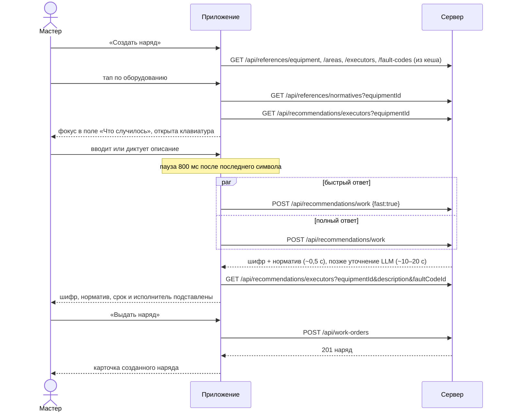

# НарядAI — создание наряда в мобильном приложении

Задание для разработчика мобильного клиента (или для ИИ-агента, который его пишет). Описано всё, что нужно для экрана «Новый наряд»: порядок шагов, логика состояния, запросы и ответы, ошибки, крайние случаи и смежные действия (правка, переназначение, отмена, история).

Эталонная реализация — веб-панель: `hackathon_crm/src/components/orders/CreateOrderModal.jsx`. Общие правила API (авторизация, даты, ошибки, фото, голос, push) — в [FRONTEND.md](FRONTEND.md).

---

## Содержание

1. [Цель и требования кейса](#1-цель-и-требования-кейса)
2. [Кто создаёт и откуда открывается экран](#2-кто-создаёт-и-откуда-открывается-экран)
3. [Сценарий по шагам](#3-сценарий-по-шагам)
4. [Состояние экрана и правила подстановки](#4-состояние-экрана-и-правила-подстановки)
5. [Запросы](#5-запросы)
6. [Сборка тела `POST /api/work-orders`](#6-сборка-тела-post-apiwork-orders)
7. [Ошибки и крайние случаи](#7-ошибки-и-крайние-случаи)
8. [После создания: правка, переназначение, отмена, история](#8-после-создания-правка-переназначение-отмена-история)
9. [Макет экрана](#9-макет-экрана)
10. [Чек-лист приёмки](#10-чек-лист-приёмки)
11. [Промт для ИИ-агента](#11-промт-для-ии-агента)

---

## 1. Цель и требования кейса

| № | Требование | Как выполняется |
|---|---|---|
| 1 | Мастер создаёт и выдаёт наряд с телефона **за 1 минуту и не более чем за 6 нажатий** | «Создать» → тап по оборудованию → описание (текст или голос) → «Выдать». Остальное подставляет ИИ. 3 нажатия + ввод текста, голосом — 5 |
| 2 | При выборе исполнителя виден статус: **свободен / выполняет наряд №… / в очереди N нарядов / не на смене** | поле `statusText` в списке исполнителей |
| 3 | ИИ предлагает исполнителя: **свободного, нужной специальности, с лучшим рейтингом по этому типу оборудования** | `GET /api/recommendations/executors`, первый в списке выбирается автоматически |
| 4 | ИИ предлагает **шифр неисправности и норматив времени** по описанию | `POST /api/recommendations/work`: быстрый ответ за ~0,5 с, затем уточнение LLM |
| 5 | Мастер может **переназначить, отменить, изменить приоритет**; всё в истории | `reassign`, `action: CANCEL`, `PATCH`; сервер пишет событие с прежним и новым значением |

**Главный принцип:** мастер ничего не обязан заполнять, кроме оборудования и описания. Всё остальное приходит с разумным значением по умолчанию, и любое из них можно поменять вручную.

---

## 2. Кто создаёт и откуда открывается экран

- Создавать наряды могут роли **`MASTER`** и **`ADMIN`** (`user.role` из `GET /api/auth/me`). Исполнителю (`EXECUTOR`) и руководителю (`MANAGER`) кнопку «Создать наряд» не показывайте: сервер ответит `403`.
- Точки входа:

| Откуда | Что передать в экран |
|---|---|
| Список нарядов, кнопка «+» | ничего |
| Карточка оборудования, кнопка «Создать наряд» | `equipmentId` — шаг 1 уже пройден |
| Скан QR на оборудовании | `GET /api/equipment/qr/<qrToken>` → `equipment.id` → как из карточки |

QR содержит ссылку вида `…/equipment/<qrToken>`; берите **последний сегмент пути**, домен может отличаться.

---

## 3. Сценарий по шагам



### Шаг 0. Открытие экрана
Загрузите справочники, если их ещё нет в кеше: оборудование, участки, исполнители, шифры, бригады ([§5.1](#51-справочники)). Держите их в кеше 5–10 минут; исполнителей — 1 минуту (у них меняется статус).

### Шаг 1. Оборудование (1 нажатие)
- Сразу под поиском показывайте **весь список** оборудования, чтобы выбрать одним тапом без ввода. Поиск фильтрует локально по названию, инвентарному номеру, типу и названию участка.
- В строке: название, инв. номер, участок, критичность 1–5.
- После выбора:
  - **участок берётся из `equipment.areaId`**, отдельно его не спрашивайте;
  - загрузите нормативы этого оборудования и список рекомендованных исполнителей;
  - переведите фокус в поле описания и откройте клавиатуру;
  - сбросьте ручной выбор шифра, норматива и исполнителя (см. [§4](#4-состояние-экрана-и-правила-подстановки)).
- Кнопка «Сменить» возвращает к выбору.

### Шаг 2. Что случилось (ввод текста или 2 нажатия голосом)
- Многострочное поле, минимум 3 символа.
- Кнопка микрофона: тап — запись, второй тап — стоп и распознавание → `POST /api/ai/transcribe` ([§5.6](#56-голосовой-ввод)). Распознанный текст **дописывается** к уже введённому через пробел. Поле остаётся редактируемым.
- Через **800 мс** после последнего изменения текста запускаются подсказки ИИ (шаг 3). Не отправляйте запрос на каждый символ.

### Шаг 2а. Приоритет (0–1 нажатие)
- Четыре кнопки: **Аварийный / Высокий / Обычный / Плановый**. По умолчанию — «Обычный».
- Тип наряда отдельно не спрашивайте: `type = priority === "EMERGENCY" ? "EMERGENCY" : "PLANNED"`.
- «Аварийный» на сервере открывает простой оборудования и шлёт исполнителю push в звуковой канал `emergency_orders`. Красьте кнопку «Выдать» в красный, чтобы мастер видел, что отправляет аварию.

### Шаг 3. Подсказка ИИ: шифр, норматив, срок (0 нажатий)
- Когда есть оборудование и описание (≥ 3 символов после паузы), **одновременно** отправьте два запроса `POST /api/recommendations/work`:
  1. `fast: true` — голосование по похожим закрытым нарядам предприятия, **~0,5 с**. Если похожих нет, вернёт `faultCodeId: null`.
  2. без `fast` — LLM с учётом похожих нарядов, **10–20 с**.
- Показывайте быстрый ответ сразу, а когда придёт полный — замените им быстрый. Пока полный идёт, показывайте «ИИ уточняет…».
- Подставьте `faultCodeId` и `normativeId` в форму, если мастер не менял их вручную.
- **Срок:**
  - есть норматив → «до ЧЧ:ММ (по нормативу)», где время = сейчас + `normative.hours`. В запрос `deadline` не передавайте: сервер посчитает сам;
  - нет норматива → кнопки **1 ч / 2 ч / 4 ч / 8 ч**, по умолчанию 2 ч; в запрос идёт `deadline` = сейчас + выбранные часы;
  - точный срок вручную — в «Дополнительно».
- Кнопка «Изменить» открывает два выпадающих списка: шифр (`/api/references/fault-codes`) и норматив (`/api/references/normatives?equipmentId`). При ручном выборе шифра подставьте норматив с тем же `faultCodeId`, если он есть.
- Ошибка или таймаут подсказки **не блокирует** создание: покажите «ИИ не нашёл шифр — выберите вручную» и продолжайте.

### Шаг 4. Исполнитель (0 нажатий, при желании 1)
- `GET /api/recommendations/executors?equipmentId=…&description=…&faultCodeId=…[&brigadeId=…]`.
- Перезапрашивайте при смене оборудования, описания (после паузы), шифра или бригады.
- **Первый в списке выбирается автоматически**, у него метка «ИИ рекомендует». Мастер может тапнуть другого — после этого автоподстановка исполнителя отключается.
- Показывайте первые 3; кнопка «Все исполнители (N)» раскрывает остальных рекомендованных и всех из `GET /api/references/executors`, включая тех, кто не на смене (они полупрозрачные, но выбрать можно).
- В карточке исполнителя:
  - ФИО, специальность, разряд;
  - **статус** из `statusText` с цветом: свободен — зелёный, `выполняет…` — жёлтый, `в очереди…` — голубой, `не на смене` — серый;
  - короткие причины выбора: `specialtyMatch` (✓ «нужная специальность» или ⚠ «нужен Электрик»), `equipmentRating` и `equipmentOrders` («★ 4.6 · 8 нарядов на этом типе»). Готовые фразы есть в `reasons[]`.

### Шаг 5. Дополнительно (свёрнуто, необязательно)
- **Бригада** — выдать бригаде. Список исполнителей фильтруется по бригаде (`brigadeId` в рекомендациях). Если исполнителя не выбрать, старшего назначит сервер.
- **Точный срок** — заменяет срок по нормативу.
- **Комментарий.**
- **Фото «до»** — до 5 штук, каждое загружается через `POST /api/uploads` ([§5.5](#55-фото-до)).

### Шаг 6. Выдать (1 нажатие)
- Кнопка внизу экрана закреплена всегда. Пока чего-то не хватает, она неактивна и пишет, чего именно: «Выберите оборудование» → «Опишите проблему» → «Выберите исполнителя».
- Над кнопкой — итог одной строкой: исполнитель · приоритет · шифр · срок.
- Нажатие → загрузка фото (если есть) → `POST /api/work-orders` ([§6](#6-сборка-тела-post-apiwork-orders)) → при `201` откройте карточку созданного наряда (`order.id`, номер `order.number`).
- Блокируйте кнопку на время отправки: повторное нажатие создаст второй наряд.

### Подсчёт нажатий

| Сценарий | Нажатия |
|---|---|
| Из списка, описание текстом | «Создать» → оборудование → «Выдать» = **3** + ввод текста |
| Из списка, описание голосом | «Создать» → оборудование → микрофон → стоп → «Выдать» = **5** |
| Из карточки оборудования или QR | «Создать наряд» → описание → «Выдать» = **2–4** |
| Мастер меняет исполнителя или приоритет | **+1** за каждое |

---

## 4. Состояние экрана и правила подстановки

```ts
type QuickOrderState = {
  equipmentId: number | null;
  description: string;
  priority: "EMERGENCY" | "HIGH" | "NORMAL" | "PLANNED"; // по умолчанию NORMAL
  manualWork: { faultCodeId: number | null; normativeId: number | null } | null; // null — следовать ИИ
  manualAssigneeId: number | null;                                              // null — следовать ИИ
  deadlineHours: 1 | 2 | 4 | 8;                                                 // если нет норматива; по умолчанию 2
  customDeadline: string | null;                                                // ISO, из «Дополнительно»
  brigadeId: number | null;
  comment: string;
  photos: LocalFile[];                                                          // ≤ 5, ≤ 15 МБ каждое
};
```

**Итоговые значения вычисляются, а не копируются в состояние:**

```ts
const problem = debounce(description.trim(), 800);
const suggestion = fullWork ?? (fastWork?.faultCodeId ? fastWork : null);

const faultCodeId = manualWork ? manualWork.faultCodeId : suggestion?.faultCodeId ?? null;
const normativeId = manualWork ? manualWork.normativeId : suggestion?.normativeId ?? null;
const assigneeId  = manualAssigneeId ?? recommended[0]?.id ?? null;

const deadline = customDeadline
  ?? addHours(now, normative ? Number(normative.hours) : deadlineHours);

const missing =
  !equipmentId                  ? "Выберите оборудование" :
  description.trim().length < 3 ? "Опишите проблему" :
  !assigneeId && !brigadeId     ? "Выберите исполнителя" : null;
```

Правила:
- **Ручной выбор всегда главнее ИИ.** Пока мастер ничего не трогал, поля следуют за последней подсказкой: если LLM уточнила шифр, форма обновится сама. Как только мастер выбрал шифр, норматив или исполнителя вручную, подсказка это поле больше не перезаписывает.
- **Смена оборудования** сбрасывает `manualWork` и `manualAssigneeId`.
- **Смена бригады** сбрасывает `manualAssigneeId`: старший подбирается заново внутри бригады.
- Запросы подсказок кешируйте по ключу `(equipmentId, description, fast)`: при возврате к тому же тексту повторный запрос не нужен.

---

## 5. Запросы

Все запросы — с заголовком `Authorization: Bearer <token>`. Базовый URL — см. [FRONTEND.md §1](FRONTEND.md#1-подключение). Ошибки приходят как `{ "error": "Текст по-русски" }`, их можно показывать как есть.

**Десятичные числа приходят строками:** `normative.hours` выглядит как `"3"` или `"2.5"`. Перед расчётами делайте `Number()`.

### 5.1. Справочники

| Запрос | Ответ (главные поля) | Кеш |
|---|---|---|
| `GET /api/references/equipment` | `[{ id, name, inventoryNumber, type, criticality (1–5), areaId, qrToken }]` | 10 мин |
| `GET /api/references/areas` | `[{ id, name }]` | 10 мин |
| `GET /api/references/fault-codes` | `[{ id, code: "М-02", name: "Разрушение подшипника", category: "М" }]` | 10 мин |
| `GET /api/references/brigades` | `[{ id, name, members: [{ id, fullName, specialty }] }]` | 10 мин |
| `GET /api/references/executors` | см. ниже | 1 мин |
| `GET /api/references/normatives?equipmentId=77` | `[{ id, name, hours: "3", faultCodeId, equipmentType, equipmentId, materialNorms }]` | 10 мин |

`normatives?equipmentId=` возвращает нормативы **этой единицы и её типа оборудования** (большинство нормативов заданы на тип). Неизвестный `equipmentId` → `404`.

`GET /api/references/executors` — все исполнители со статусом:

```json
[{
  "id": 60,
  "fullName": "Ахметов Ерлан Серикович",
  "specialty": "Слесарь",
  "grade": 6,
  "brigadeId": 11,
  "brigade": { "id": 11, "name": "Бригада №1" },
  "employeeStatus": "BUSY",
  "isOnShift": true,
  "currentOrder": { "id": 1544, "number": "Н-00513", "status": "IN_PROGRESS", "priority": "HIGH", "deadline": "…", "equipment": { "name": "Дробилка КМД-1750 (Д-2)" } },
  "queue": 1,
  "activeOrders": 2,
  "statusText": "выполняет наряд №Н-00513, в очереди 1"
}]
```

Возможные `statusText`: `свободен`, `выполняет наряд №…`, `выполняет наряд №…, в очереди N`, `в очереди N наряд(а/ов)`, `не на смене`. Фильтры: `?specialty=Электрик`, `?brigadeId=11`, `?onShift=1`.

### 5.2. Рекомендованные исполнители

`GET /api/recommendations/executors?equipmentId=77&description=Гул%20подшипника&faultCodeId=63&brigadeId=11`

| Параметр | |
|---|---|
| `equipmentId` | обязателен; без него — `400`, неизвестный — `404` |
| `description` | текст проблемы: по нему определяется нужная специальность |
| `faultCodeId` | шифр: категория `Э` — электрик, `М/Г/П/С` — слесарь; важнее описания |
| `specialty` | явная специальность; важнее всего |
| `brigadeId` | искать только в бригаде |

Ответ — **только исполнители на смене**, уже отсортированные: сначала нужной специальности, внутри — по баллу (свободен +50, в очереди +20, рейтинг на этом типе оборудования ×8, −3 за каждый активный наряд).

```json
[{
  "id": 70,
  "fullName": "Касымов Руслан Айдарович",
  "specialty": "Слесарь",
  "grade": 5,
  "brigadeId": 12,
  "employeeStatus": "AVAILABLE",
  "statusText": "свободен",
  "currentOrder": null,
  "queue": 0,
  "equipmentRating": 5,
  "equipmentOrders": 3,
  "specialtyMatch": true,
  "requiredSpecialty": "Слесарь",
  "score": 90,
  "reasons": ["свободен", "нужная специальность: Слесарь", "оценка 5.0 по 3 нарядам на «Дробилка»"]
}]
```

- `specialtyMatch`: `true` / `false` / `null` (нет подсказок о работе — специальность не учитывается).
- `equipmentRating` — средняя оценка закрытых нарядов исполнителя на этом **типе** оборудования (3, если таких нет); `equipmentOrders` — по скольким нарядам.
- `queue` — число активных нарядов (в работе и в очереди).
- `reasons[0]` всегда совпадает с `statusText`.
- Ответ приходит за ~50 мс.

### 5.3. Шифр и норматив по описанию

`POST /api/recommendations/work`

```json
{ "description": "Гул и нагрев подшипника эксцентрика, вибрация", "equipmentId": 77, "fast": true }
```

```json
{
  "faultCodeId": 63,
  "normativeId": 113,
  "estimatedHours": 3,
  "explanation": "По похожим закрытым нарядам предприятия",
  "basedOn": 4,
  "faultCode": { "id": 63, "code": "М-02", "name": "Разрушение подшипника" },
  "normative": { "id": 113, "name": "Разрушение подшипника: дробилка", "hours": 3 }
}
```

| | `fast: true` | без `fast` |
|---|---|---|
| Как считает | голосование похожих закрытых нарядов (RAG-память) | LLM выбирает из справочника с учётом похожих нарядов |
| Время | ~0,5 с | 10–20 с |
| Нет похожих нарядов | `faultCodeId: null`, `normativeId: null`, `basedOn: 0` | ответ по справочнику |
| LLM недоступна | — | голосование похожих нарядов, а без них — первый шифр справочника с `explanation: "Базовая рекомендация по справочнику"` |

- `description` — минимум 3 символа, иначе `400`.
- `faultCode` и `normative` уже развёрнуты: дополнительно искать их в справочнике не нужно.
- Норматив всегда согласован с шифром: если у шифра есть свой норматив, придёт он.
- `explanation` — одно-два предложения для мастера, без внутренних id.
- `basedOn` — по скольким похожим нарядам дана подсказка; можно показать «по 4 похожим нарядам».
- Ставьте таймаут **30 с** на полный запрос.

### 5.4. Создание наряда

`POST /api/work-orders` — см. [§6](#6-сборка-тела-post-apiwork-orders).

### 5.5. Фото «до»

`POST /api/uploads`, `multipart/form-data`, поле `file`, до 15 МБ; необязательное поле `takenAt` (ISO), если у снимка нет EXIF.

```json
{ "url": "/uploads/8e3a…?exp=1791828000&sig=dE5Z…", "originalName": "photo.jpg", "size": 183402, "takenAt": "2026-10-08T14:20:00.000Z" }
```

`url` передавайте в `beforePhotoUrls` как есть. Загружайте фото **последовательно** перед созданием наряда. Если загрузка не удалась, наряд не создавайте и покажите ошибку.

### 5.6. Голосовой ввод

`POST /api/ai/transcribe`, `multipart/form-data`, поле `audio` (m4a/aac, ogg/opus, webm, mp3, wav; до 25 МБ).

```json
{ "text": "гул и нагрев подшипника эксцентрика" }
```

| Ответ | Что делать |
|---|---|
| `200 { text }` | дописать к описанию; поле остаётся редактируемым |
| `422 Речь не распознана` | «Не расслышали, повторите» |
| `502 …` | «Распознавание недоступно, введите текстом» |

Около 0,6 с на фразу. Оптимально записи по 5–20 с.

---

## 6. Сборка тела `POST /api/work-orders`

```ts
const body: Record<string, unknown> = {
  type: priority === "EMERGENCY" ? "EMERGENCY" : "PLANNED",
  priority,                                 // EMERGENCY | HIGH | NORMAL | PLANNED
  description: description.trim(),         // ≥ 3 символов
  areaId: equipment.areaId,                 // из выбранного оборудования
  equipmentId: equipment.id,
};
if (assigneeId)  body.assigneeId  = assigneeId;
if (brigadeId)   body.brigadeId   = brigadeId;
if (normativeId) body.normativeId = normativeId;
if (faultCodeId) body.faultCodeId = faultCodeId;          // предложенный шифр; исполнитель может сменить при завершении
if (customDeadline || !normativeId) body.deadline = deadline.toISOString();
if (comment.trim()) body.comment = comment.trim();
if (beforePhotoUrls.length) body.beforePhotoUrls = beforePhotoUrls;  // ≤ 5
```

Пример:

```json
{
  "type": "PLANNED",
  "priority": "NORMAL",
  "description": "Гул и нагрев подшипника эксцентрика, вибрация",
  "areaId": 21,
  "equipmentId": 77,
  "assigneeId": 70,
  "normativeId": 113,
  "faultCodeId": 63
}
```

Правила сервера:

| Поле | Правило |
|---|---|
| `type`, `priority`, `description`, `areaId`, `equipmentId` | обязательны |
| `assigneeId` **или** `brigadeId` | хотя бы одно. Только `brigadeId` — старшего выберет сервер (лучший по подбору член бригады на смене). Оба — исполнитель обязан быть в этой бригаде |
| `deadline` **или** `normativeId` | хотя бы одно; без `deadline` срок = сейчас + часы норматива |
| `equipmentId` | должен принадлежать `areaId` |
| `assigneeId` | только роль `EXECUTOR` |
| `faultCodeId` | необязателен; несуществующий → `400` |
| `beforePhotoUrls` | до 5 ссылок из `/api/uploads` |

Ответ `201` — полный наряд:

```json
{
  "id": 1601, "number": "N-12345678", "status": "ISSUED", "type": "PLANNED", "priority": "NORMAL",
  "description": "…", "deadline": "2026-10-08T18:05:00.000Z",
  "area": { "id": 21, "name": "Дробление" },
  "equipment": { "id": 77, "name": "Дробилка КМД-1750 (Д-2)", "inventoryNumber": "INV-1002", "type": "Дробилка" },
  "assignee": { "id": 70, "fullName": "Касымов Руслан Айдарович", "specialty": "Слесарь", "employeeStatus": "QUEUED" },
  "faultCode": { "id": 63, "code": "М-02", "name": "Разрушение подшипника" },
  "normative": { "id": 113, "name": "Разрушение подшипника: дробилка", "hours": "3" },
  "photos": [], "brigade": null, "creator": { "id": 56, "fullName": "Нурланов Арман Болатович" }
}
```

Что делает сервер после создания:
- пишет в историю событие `CREATE` с комментарием «Исполнитель: …; приоритет: …; норматив: … (3 ч); срок: …»;
- исполнитель получает уведомление `NEW_ORDER` и push; для аварийного — в канал `emergency_orders` со звуком;
- при выдаче бригаде остальные члены бригады на смене получают `BRIGADE_ORDER`;
- для `type: EMERGENCY` открывается простой оборудования;
- статус исполнителя пересчитывается («в очереди 1 наряд»);
- всем подписанным через Socket.IO уходит `work-order:changed`;
- наряд ставится в очередь выгрузки в 1С.

---

## 7. Ошибки и крайние случаи

| Ситуация | Ответ | Что показать / сделать |
|---|---|---|
| Нет оборудования / описания / исполнителя | — | кнопка неактивна и пишет, чего не хватает |
| Нет ни срока, ни норматива | `400 Ошибка в данных запроса`, `details: Укажите срок или норматив` | не должно случаться: без норматива приложение всегда шлёт `deadline` |
| Оборудование не на участке, исполнитель не `EXECUTOR` | `400 Проверьте оборудование и исполнителя` | обновить справочники |
| Неверный норматив | `400 Норматив не найден` | обновить нормативы |
| Неверный шифр | `400 Шифр неисправности не найден` | убрать шифр и повторить |
| Бригада пуста / исполнитель не в бригаде | `400 В бригаде нет исполнителей на смене` / `400 Исполнитель не состоит в этой бригаде` | показать текст |
| Роль не мастер и не админ | `403` | кнопку «Создать» таким ролям не показывать |
| Токен истёк | `401` | на экран входа; черновик формы сохранить |
| Совпадение номера в одну миллисекунду | `409 Такая запись уже существует` | можно повторить |
| ИИ-подсказка упала или долго думает | ошибка или таймаут | не блокировать; «ИИ не нашёл шифр — выберите вручную» |
| На смене нет исполнителей | пустой массив рекомендаций | «На смене нет исполнителей» + «Все исполнители» |

**Создание не идемпотентно.** Повторная отправка создаст второй наряд, поэтому:
- блокируйте кнопку на время запроса;
- **не ставьте создание в офлайн-очередь** (в отличие от действий по наряду, у которых есть `clientActionId`);
- без сети сразу покажите «Нет соединения. Создание наряда не ставится в очередь, чтобы не создать дубль»;
- если соединение оборвалось **во время** запроса, не повторяйте автоматически. Покажите «Соединение оборвалось. Проверьте список нарядов, прежде чем создавать снова» и обновите список (`GET /api/work-orders?limit=20`).

**Черновик:** сохраняйте состояние формы локально, чтобы при сворачивании приложения или истечении токена мастер не потерял введённое. После успешного создания черновик удаляйте.

---

## 8. После создания: правка, переназначение, отмена, история

Все действия ниже доступны `MASTER` и `ADMIN`. Каждое пишется в историю наряда.

### Изменить приоритет или срок — `PATCH /api/work-orders/:id`

```json
{ "priority": "EMERGENCY" }
```
```json
{ "deadline": "2026-10-09T08:00:00.000Z", "comment": "Перенос по согласованию" }
```

- Все поля необязательны; передавайте только то, что меняете. `deadline: null` или `""` означает «не менять».
- В историю пишется событие `EDIT` с прежним и новым значением: `приоритет: обычный → аварийный; срок: 08.10.2026, 20:05 → 09.10.2026, 13:00`.
- При смене приоритета исполнитель получает уведомление `ORDER_CHANGED`.
- Если ничего не изменилось, событие не пишется.
- `409` — наряд в статусе `COMPLETED`, `AI_REVIEW`, `CLOSED`, `CANCELLED` или `REJECTED`: менять нельзя. Показывайте «Изменить» только для `ISSUED`, `ACCEPTED`, `QUEUED`, `IN_PROGRESS`, `PAUSED`, `REWORK`.

### Переназначить — `POST /api/work-orders/:id/reassign`

```json
{ "assigneeId": 64, "comment": "Касымов на аварии на участке обогащения" }
```

- Экран переназначения сразу (без отдельной кнопки) загружает `GET /api/recommendations/executors?equipmentId=<order.equipmentId>&description=<order.description>&faultCodeId=<order.faultCodeId>&brigadeId=<order.brigadeId>` и показывает те же карточки, что при создании. Текущего исполнителя из списка уберите.
- `comment` — причина, необязательна, до 1000 символов.
- Наряд возвращается в `ISSUED`. Новый исполнитель получает `NEW_ORDER`, прежний — `ORDER_REASSIGNED` («Наряд передан другому исполнителю»).
- Если наряд был выдан бригаде, а новый исполнитель не из неё, `brigadeId` сбрасывается в `null`.
- В историю пишется `REASSIGN`: `Ахметов Ерлан Серикович → Ким Вадим Олегович. Причина: …`.
- `400 Наряд уже назначен этому исполнителю`, `400 Назначить можно только исполнителя`, `409` — наряд в статусе `COMPLETED`, `AI_REVIEW`, `CLOSED` или `CANCELLED`.

### Отменить — `POST /api/work-orders/:id/action`

```json
{ "action": "CANCEL", "comment": "Оборудование выведено в резерв", "clientActionId": "b7c1…uuid" }
```

- Доступно из `ISSUED`, `ACCEPTED`, `QUEUED`, `IN_PROGRESS`, `PAUSED`, `REWORK`; иначе `409`.
- Причину лучше спрашивать всегда: она попадёт в историю.
- Простой оборудования закрывается автоматически.
- `clientActionId` (уникальная строка 8–100 символов) делает действие идемпотентным: его можно ставить в офлайн-очередь и повторять — повтор вернёт `replayed: true`.

### История — `GET /api/work-orders/:id` → `events[]`

```json
{
  "events": [
    { "id": 1, "action": "CREATE",   "fromStatus": null,        "toStatus": "ISSUED",      "comment": "Исполнитель: Касымов Руслан Айдарович; приоритет: обычный; норматив: Разрушение подшипника: дробилка (3 ч); срок: 08.10.2026, 23:05", "actor": { "fullName": "Нурланов Арман Болатович" }, "createdAt": "…" },
    { "id": 2, "action": "EDIT",     "fromStatus": "ISSUED",    "toStatus": "ISSUED",      "comment": "приоритет: обычный → аварийный", "actor": { … }, "createdAt": "…" },
    { "id": 3, "action": "REASSIGN", "fromStatus": "ISSUED",    "toStatus": "ISSUED",      "comment": "Касымов Руслан Айдарович → Ким Вадим Олегович. Причина: …", "actor": { … }, "createdAt": "…" },
    { "id": 4, "action": "CANCEL",   "fromStatus": "ISSUED",    "toStatus": "CANCELLED",   "comment": "Оборудование выведено в резерв", "actor": { … }, "createdAt": "…" }
  ]
}
```

Подписи событий для ленты:

| `action` | Подпись | `action` | Подпись |
|---|---|---|---|
| `CREATE` | Наряд выдан | `PAUSE` | Приостановлен |
| `EDIT` | Наряд изменён | `RESUME` | Работа продолжена |
| `REASSIGN` | Переназначен | `COMPLETE` | Работа завершена |
| `COMMENT` | Комментарий | `AI_REVIEW` | Проверен ИИ |
| `ACCEPT` | Принят | `SEND_TO_REWORK` | Возвращён на доработку |
| `QUEUE` | Поставлен в очередь | `CLOSE` | Закрыт |
| `REJECT` | Отклонён | `CANCEL` | Отменён |
| `START` | Работа начата | | |

Если `fromStatus !== toStatus`, показывайте переход статуса («Выдан → Принят»). `comment` показывайте целиком: в нём уже написано, что изменилось. `actor: null` — «Система».

---

## 9. Макет экрана

```
┌───────────────────────────────────────┐
│ [+] Новый наряд                     ✕ │
│     Три шага — остальное подскажет ИИ │
│ ███████  ███████  ░░░░░░░             │  прогресс: 1 Оборудование · 2 Что случилось · 3 Исполнитель
├───────────────────────────────────────┤
│ ✓ Оборудование               Сменить  │
│ [🔧] Дробилка КМД-1750 (Д-2)          │
│      INV-1002 · Дробление · ▂▃▅▆█     │  критичность
├───────────────────────────────────────┤
│ ✓ Что случилось                       │
│ ┌───────────────────────────────────┐ │
│ │ Гул и нагрев подшипника…      (🎤)│ │
│ └───────────────────────────────────┘ │
│ Приоритет                             │
│ [🚨 Аварийный][● Высокий]             │
│ [● Обычный  ][● Плановый]             │
├───────────────────────────────────────┤
│ ✨ Подсказка ИИ        ● ИИ уточняет… │
│ ШИФР  [М-02] Разрушение подшипника    │
│ НОРМАТИВ  Разрушение подшипника  ⏱3 ч │
│ │ По похожим закрытым нарядам         │
│ ⏱ Срок до 23:05            Изменить   │
├───────────────────────────────────────┤
│ ✓ Исполнитель                         │
│ (КР) Касымов Руслан Айдарович      ◉  │
│      [✨ ИИ РЕКОМЕНДУЕТ]               │
│      ● свободен  Слесарь · 5 разряд   │
│      ✓ нужная специальность           │
│      ★ 5.0 · 3 наряда на этом типе    │
│ (КВ) Ким Вадим Олегович            ○  │
│ [ Все исполнители (14) ⌄ ]            │
├───────────────────────────────────────┤
│ ⚙ Дополнительно                    ⌄  │  бригада, точный срок, комментарий, фото
├───────────────────────────────────────┤
│ (КР) Касымов Р. А. · ● Обычный · М-02 · до 23:05 │
│ [        ➤  Выдать наряд        ]     │  закреплено внизу
└───────────────────────────────────────┘
```

---

## 10. Чек-лист приёмки

- [ ] Кнопка «Создать наряд» видна только `MASTER` и `ADMIN`.
- [ ] Из карточки оборудования и по QR форма открывается с выбранным оборудованием.
- [ ] Оборудование выбирается одним тапом без ввода; поиск работает по названию, инв. номеру, типу и участку.
- [ ] Участок не спрашивается — берётся из оборудования.
- [ ] После выбора оборудования фокус и клавиатура переходят в описание.
- [ ] Голос: запись → распознавание → текст дописывается и остаётся редактируемым.
- [ ] Подсказка ИИ запускается через 800 мс после ввода, а не на каждый символ.
- [ ] Быстрый ответ (`fast: true`) появляется за ~0,5 с, полный заменяет его без мигания формы.
- [ ] Шифр, норматив, срок и исполнитель подставляются сами; ручной выбор ИИ больше не перезаписывает.
- [ ] Ошибка ИИ не мешает создать наряд.
- [ ] У каждого исполнителя виден статус из `statusText`; у первого — «ИИ рекомендует».
- [ ] «Все исполнители» показывает и тех, кто не на смене.
- [ ] Без норматива срок выбирается кнопками 1/2/4/8 ч и уходит в `deadline`.
- [ ] «Аварийный» → `type: EMERGENCY`, кнопка «Выдать» красная.
- [ ] Кнопка «Выдать» неактивна, пока чего-то не хватает, и пишет чего.
- [ ] Повторное нажатие во время отправки ничего не делает; создание не ставится в офлайн-очередь.
- [ ] После `201` открывается карточка созданного наряда.
- [ ] Сценарий «из списка, текстом» укладывается в 3 нажатия и меньше минуты.
- [ ] Правка, переназначение (с причиной) и отмена отражаются в истории с прежним и новым значением.

---

## 11. Промт для ИИ-агента

Скопируйте этот блок агенту, который пишет мобильное приложение, вместе с этим файлом и `FRONTEND.md`.

```text
Ты пишешь экран «Новый наряд» мобильного приложения НарядAI (React Native / Flutter — по проекту).
Спецификация — docs/MOBILE_CREATE_ORDER.md, общие правила API — docs/FRONTEND.md. Следуй им буквально.

Цель: мастер создаёт и выдаёт наряд с телефона за 1 минуту и не более чем за 6 нажатий.

Экран — одна прокручиваемая страница с закреплённой внизу кнопкой «Выдать наряд»:
1. Оборудование: список сразу виден, выбор одним тапом, поиск локальный. Участок = equipment.areaId.
   После выбора — фокус в описание, загрузить нормативы и рекомендованных исполнителей.
2. «Что случилось»: текст ≥ 3 символов + микрофон (POST /api/ai/transcribe, текст дописывается).
3. Приоритет: 4 кнопки, по умолчанию NORMAL; type = EMERGENCY только при приоритете EMERGENCY.
4. Подсказка ИИ: через 800 мс после ввода параллельно POST /api/recommendations/work с fast:true и без него.
   Быстрый ответ показать сразу, полный — заменить им. Подставить faultCodeId и normativeId,
   если мастер не менял их вручную. Срок = сейчас + normative.hours; без норматива — кнопки 1/2/4/8 ч (по умолчанию 2).
   Ошибка ИИ не блокирует создание.
5. Исполнитель: GET /api/recommendations/executors?equipmentId&description&faultCodeId[&brigadeId].
   Первый выбирается автоматически («ИИ рекомендует»). В карточке: ФИО, специальность, разряд,
   statusText с цветом, причины (specialtyMatch, equipmentRating, equipmentOrders).
   «Все исполнители» добавляет GET /api/references/executors (включая не на смене).
6. «Дополнительно» (свёрнуто): бригада, точный срок, комментарий, до 5 фото «до» через POST /api/uploads.
7. «Выдать»: собрать тело по §6, POST /api/work-orders, на 201 открыть карточку наряда.

Правила состояния: итоговые шифр, норматив и исполнитель вычисляются (ручной выбор ?? подсказка ИИ),
а не копируются в состояние. Смена оборудования сбрасывает ручной выбор, смена бригады — ручного исполнителя.

Надёжность: создание не идемпотентно — блокировать кнопку на время запроса, не ставить в офлайн-очередь,
при обрыве связи не повторять автоматически. Хранить черновик формы локально. Ошибки API — { error }, показывать текст.
Десятичные числа (hours) приходят строками — Number().

Роли: экран доступен только MASTER и ADMIN.

Готово, когда выполнен чек-лист §10.
```
